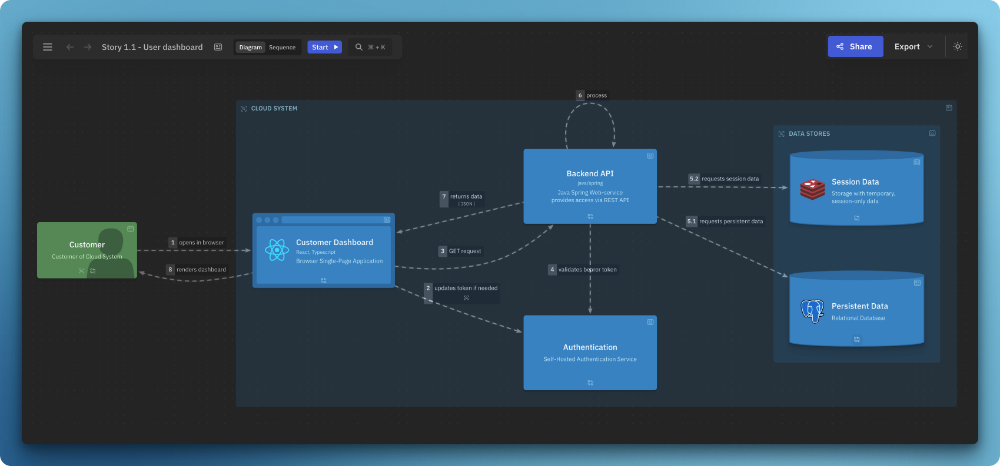
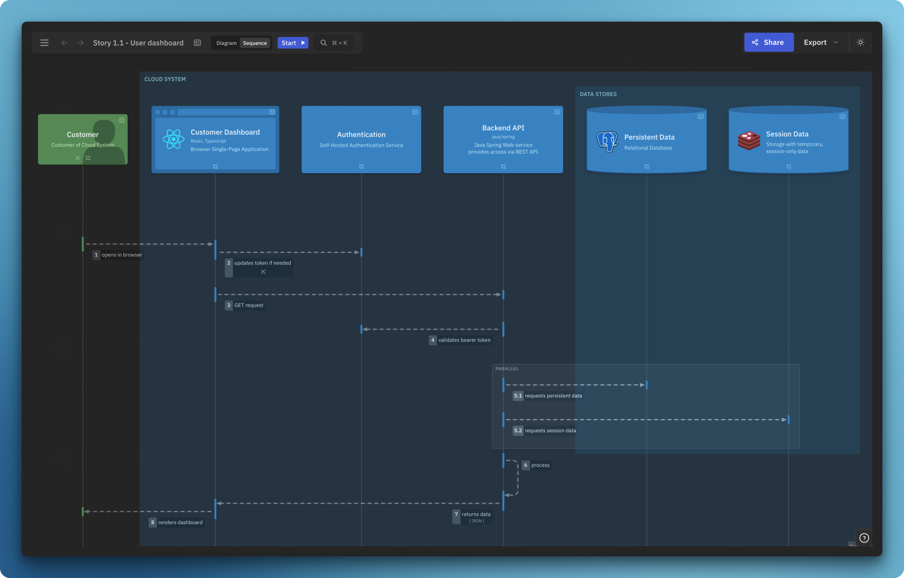
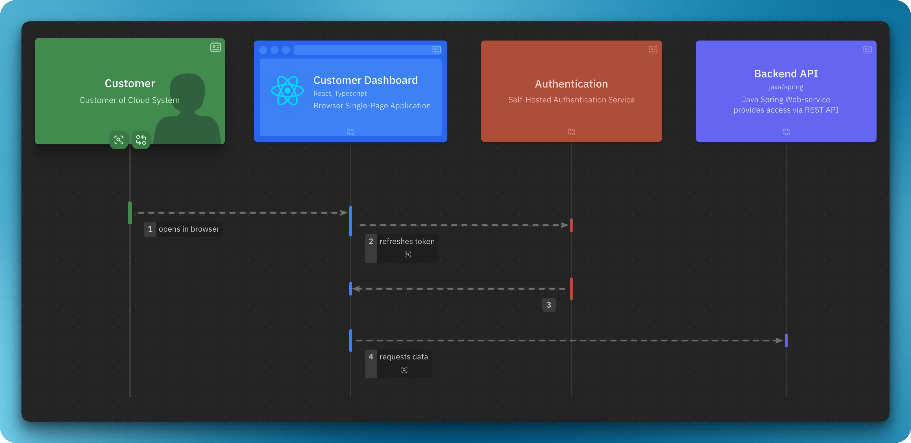
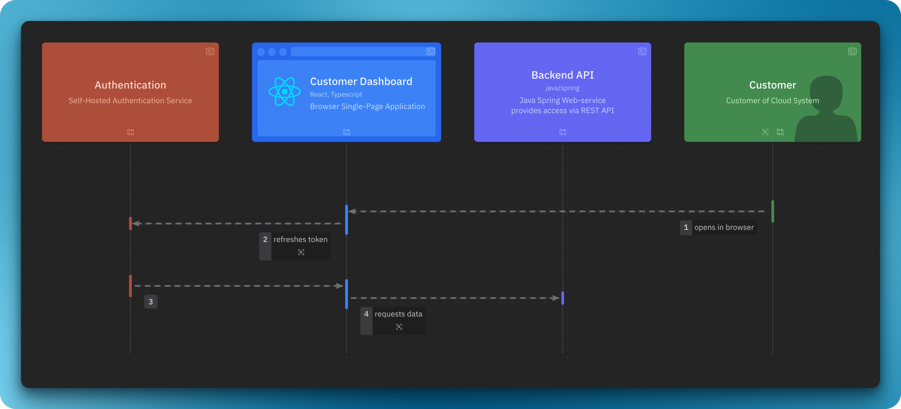

import { Aside, FileTree, Tabs, TabItem, CardGrid, LinkCard } from '@astrojs/starlight/components';

import { Card } from '@astrojs/starlight/components';
import DynamicLikeC4View from '@components/dynamic-view/DynamicLikeC4View.astro';

Dynamic view describes a particular use-case or scenario, with specific elements and interactions, defined only in the view (without polluting the model).

## Dynamic view definition

```likec4 showLineNumbers copy collapse={1-54}
//dynamic-view.c4
specification {
  element actor {
    style {
      shape person
    }
  }
  element system
  element component
}

model {
  customer = actor 'Customer' {
    description 'Customer of Cloud System'
  }

  cloud = system 'Cloud System' {
    backend = component 'Backend' {
      description 'Backend services and API'

      auth = component 'Authentication'

      api = component 'Backend API' {
        description 'RESTful API'
      }

      api -> auth 'validates bearer token' 
    }

    ui = component 'Frontend' {
      description '
        All the frontend applications
        of Cloud System
      '
      style {
        shape browser
      }

      web = component 'Customer Dashboard' {
        description 'React Application'
        style {
          shape browser
        }
      }

      web -> auth
      web -> api 'requests'
    }
  }

  customer -> web 'opens in browser'

}

views {
  dynamic view example {
    title 'Dynamic View Example'
    customer -> web 'opens in browser'
    web -> auth 'updates bearer token if needed'
    web -> api 'POST request'
    api -> auth // title is derived from the model
    api -> api 'process request' // allow self-call

    // reverse direction, as a response to line 59
    web <- api 'returns JSON'

    // Include elements, that are not participating
    include cloud, ui, backend

    style cloud {
      color muted
      opacity 0%
    }
  }
}
```

### Continuous steps

Alternative syntax for describing continuous steps: `A -> B -> C`

```likec4 copy
dynamic view example {
  customer
     -> web
     -> api // same as web -> api
     -> web // same as web <- api
}
```

It identifies the backward direction of the step, i.e. `A -> B -> A` is the same as `A -> B; A <- B`.
Nested steps are processed as well, i.e. 
```likec4
A -> B -> C -> D -> B -> A
```
is the same as 
```likec4
A -> B
B -> C
C -> D
D -> B
A <- B // is backward
```


### Parallel steps

```likec4 copy
dynamic view parallelexample {
  title 'Dynamic View Parallel Example'
  ui -> api
  parallel {
    api -> cache 
    api -> db
  }
  // or
  par {
    api -> cache 
    api -> db
  }
}
```

Nested parallel blocks are not possible - <a href="https://github.com/likec4/likec4/discussions/816#discussioncomment-10015146" target='_blank'>see this discussion</a>

### Navigation

Steps can navigate to other dynamic views:

```likec4 copy
dynamic view level1 {
  title 'Highlevel'

  ui -> api {
    navigateTo moreDetails
  }
}

dynamic view moreDetails {
  title 'Some details'
}
```

### Notes 

`notes` can be used to add additional information to the step. It supports Markdown:

```likec4 copy
dynamic view stepnotes {
  title 'Dynamic View Parallel Example'

  ui -> api {
    notes '
      🏛️ - Requests data using predefined GraphQL queries
      🤖 - Queries regression on CI
    '
  }

  parallel {
    api -> cache {
      // Supports Markdown
      notes '''
        **What it does**:
        - requests session-scoped data
        - updates TTL

      '''
    }
  }  
}
```

## Variants

Dynamic views support two variants: `diagram` and `sequence`.  
By default, dynamic views are displayed as diagrams.

### Diagram 



### Sequence 

Classic sequence diagram:



:::note
The sequence variant supports only connections with _leaf_ elements, i.e. elements that do not have any child elements.
:::

## Order of actors

The sequence variant allows to set the order of actors with `include` predicate:

**Default variant**:

```likec4 copy
dynamic view order1 {
  customer
    -> web
    -> auth
    -> web
    -> api
}
```
Steps define the order of actors.



**Ordered variant:**  

```likec4 copy {9-12}
dynamic view order2 {
  customer  
    -> web
    -> auth
    -> web
    -> api

  // Strict order
  include
    auth,
    web,
    api
}
```

`include` predicate may define order partially, for the rest order will be derived based on the steps.



## Example

Browse this example:

<DynamicLikeC4View viewId="index" variant="sequence"/>

<br/>
<CardGrid>
  <LinkCard
    title="Try it online"
    description="Open this example in LikeC4 playground"
    href="https://playground.likec4.dev/w/dynamic/"
    target="_blank"
  />
</CardGrid>
