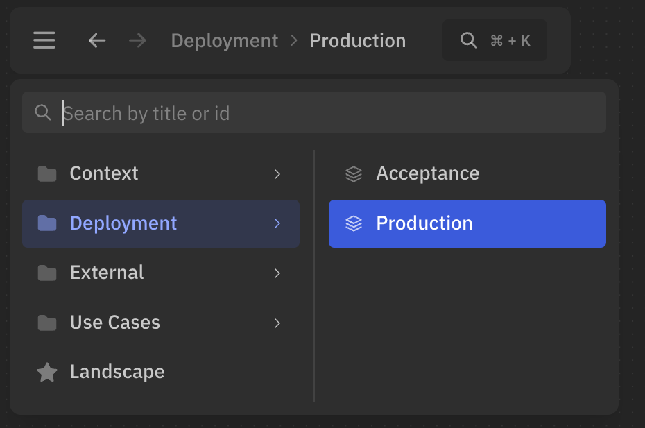

import { Aside, Tabs, TabItem } from '@astrojs/starlight/components';

You can organize views into folders to keep the workspace clean and easy to navigate.

## Create folders

To create a folder use `/` in the title.  
For example, the following view will have the title `Production`, and will be nested under `Deployment` folder:

```likec4
views {
  view {
    title 'Deployment / Production'    
  }
}
```

On the UI, this view will be displayed as:



Views can be defined in the same file, but placed in different folders:

```likec4
views {
  dynamic view {
    title 'Use Cases / 16.2 Checkout / Checkout flow'    
  }

  deployment view {
    title 'Deployments / Staging / Checkout microservice'    
  }
}
```

## Common folder

You can specify a common folder for the `views` block.  
Every view defined inside will be placed under that folder:

```likec4 "'Domain 1 / Subdomain'"
// Common folder for all views in the block
views 'Domain 1 / Subdomain' {

  view {
    // Will be displayed as 'Domain 1 / Subdomain / Landscape'
    title 'Landscape'  
  }
  
  dynamic view {
    // You can add nested folder  
    // Will be displayed as 'Domain 1 / Subdomain / Use Cases / 16.2 Checkout'
    title 'Use Cases / 16.2 Checkout'    
  }
}
```

:::caution
This feature is enabled by default in the UI, except for library usage.

```tsx
// To enable this feature:
<LikeC4Diagram
  controls="next"
/>

// To disable this feature:
<LikeC4Diagram
  controls={true} // or controls={false}
/>

// For bundled version:
<LikeC4View
  viewId="index"
  browser={{
    controls: "next"
  }}
/>
```
:::
