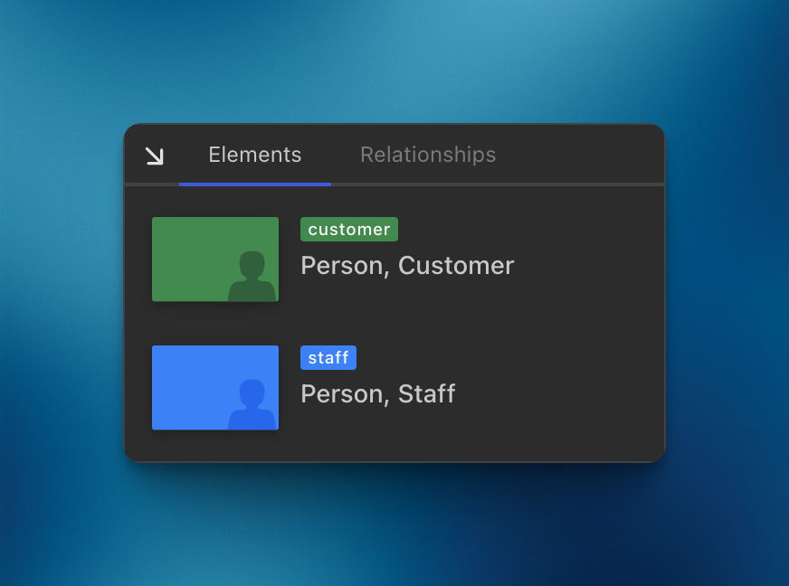

import { Aside, FileTree, Tabs, TabItem } from '@astrojs/starlight/components';

import { Card } from '@astrojs/starlight/components';
import LikeC4ThemeView from '@components/likec4-theme/LikeC4ThemeView.astro';

<Aside type='caution' title="Experimental" >
  The implementation is experimental and may change in the future.  
  The main purpose is to gather feedback, suggestions and ideas.
</Aside>

<Aside type='caution' title="In progress" >
  Relationship notations are in progress.
</Aside>

View notations (or key/legend) provide information about the meanings of shapes and styles.
It's important to provide a key explaining the difference in colors and shapes.


It is possible to define global notations (per element kind) and local (per view).

#### Global notations

As comes from the name, global notations apply to all views, and defined in the `specification` block:

```likec4 copy {4, 12}
specification {

  element customer {
    notation "Person, Customer"
    style {
      shape person
      color green
    }
  }

  element staff {
    notation "Person, Staff"
    style {
      shape person
    }
  } 
}
```

Notations will be applied to all views with these elements and displayed as:

<div style="max-width:400px;margin: 1rem auto">

</div>

Live example.  
Expand the following view and click on help icon in bottom right:

<LikeC4ThemeView viewId="notations_example"/>

#### Local notations

Local notations override global ones and apply to a specific view.

##### With style predicate

When you change the style, you can add a notation to explain the meaning:

```likec4
view {

  style webApp1, webApp2 {
    notation "Application under development"
    color amber
  }

  style element.tag = #deprecated {
    notation "Deprecated"
    color muted
  }

}
```

Notations are not merged or grouped, the last one will be applied.

:::tip

You may have same notation for different styles:

```likec4
view {

  style webApp1 {
    notation "Web Application"
    color amber
  }

  style webApp2 {
    notation "Web Application"
    color green
  }
}
```
:::


##### With overrides

Define notation when include elements:

```likec4
view {

  include *
    where kind is microservice
      and tag is #deprecated
      with {
        notation "Deprecated microservice"
        shape rectangle
        color muted
      }

}
```

This notation have higher priority, then global one or defined within style predicates. 

:::note
Feel free to share your ideas in <a href="https://github.com/likec4/likec4/discussions/" target='_blank'>GitHub discussions</a> how to improve notations, make reusable or more flexible.
:::
