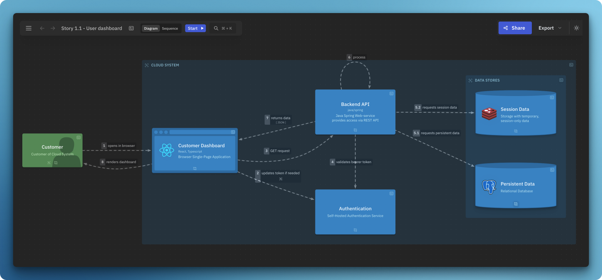
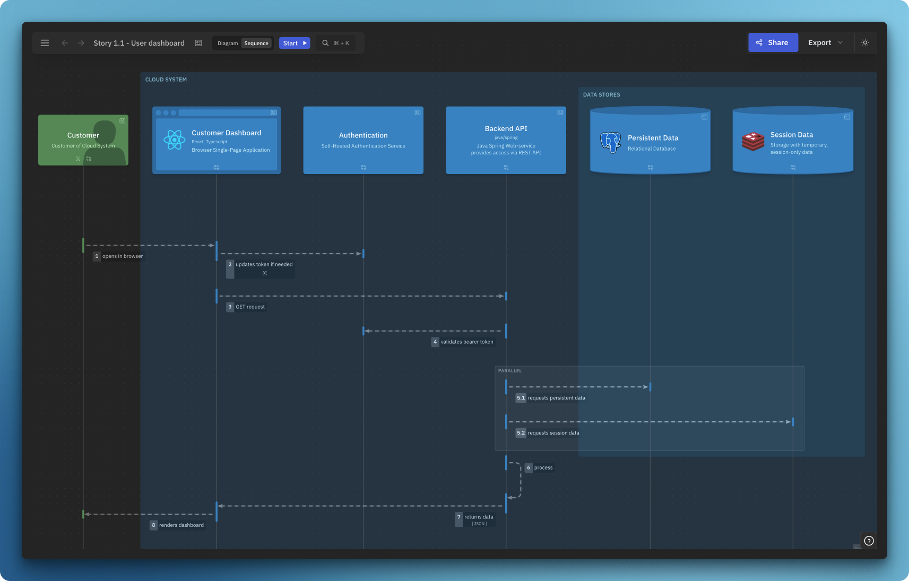
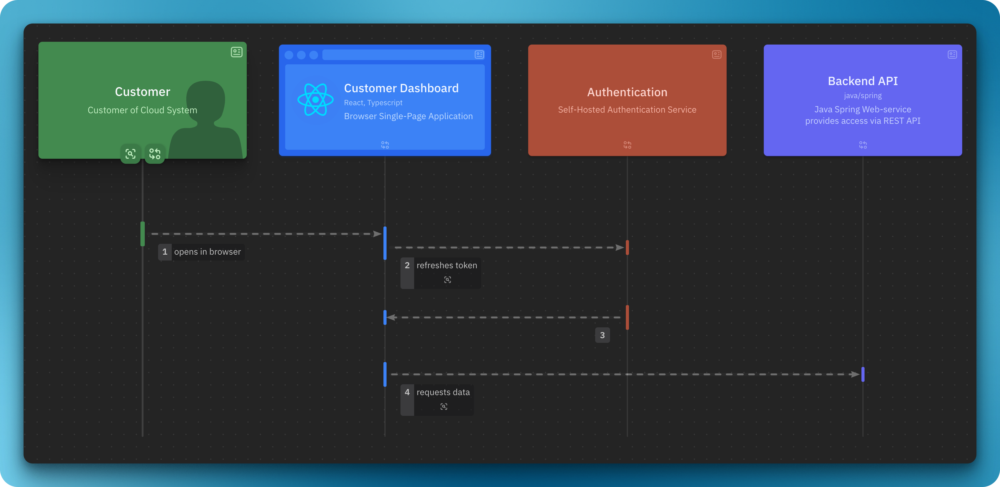
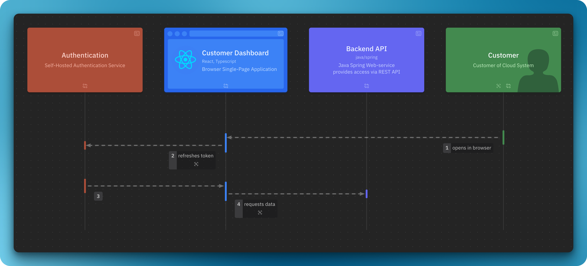

import { Aside, FileTree, Tabs, TabItem, CardGrid, LinkCard } from '@astrojs/starlight/components';

import { Card } from '@astrojs/starlight/components';
import DynamicLikeC4View from '@components/dynamic-view/DynamicLikeC4View.astro';

Uma visão dinâmica descreve um caso de uso ou cenário específico, com elementos e interações definidos apenas na própria visão (sem poluir o modelo).

## Definição de visão dinâmica

```likec4 showLineNumbers copy collapse={1-54}
//dynamic-view.c4
specification {
  element actor {
    style {
      shape person
    }
  }
  element system
  element component
}

model {
  customer = actor 'Customer' {
    description 'Customer of Cloud System'
  }

  cloud = system 'Cloud System' {
    backend = component 'Backend' {
      description 'Backend services and API'

      auth = component 'Authentication'

      api = component 'Backend API' {
        description 'RESTful API'
      }

      api -> auth 'validates bearer token' 
    }

    ui = component 'Frontend' {
      description '
        All the frontend applications
        of Cloud System
      '
      style {
        shape browser
      }

      web = component 'Customer Dashboard' {
        description 'React Application'
        style {
          shape browser
        }
      }

      web -> auth
      web -> api 'requests'
    }
  }

  customer -> web 'opens in browser'

}

views {
  dynamic view example {
    title 'Dynamic View Example'
    customer -> web 'opens in browser'
    web -> auth 'updates bearer token if needed'
    web -> api 'POST request'
    api -> auth // title is derived from the model
    api -> api 'process request' // allow self-call

    // reverse direction, as a response to line 59
    web <- api 'returns JSON'

    // Include elements, that are not participating
    include cloud, ui, backend

    style cloud {
      color muted
      opacity 0%
    }
  }
}
```

### Etapas contínuas

Sintaxe alternativa para descrever etapas contínuas: `A -> B -> C`

```likec4 copy
dynamic view example {
  customer
     -> web
     -> api // same as web -> api
     -> web // same as web <- api
}
```

Ela identifica a direção de retorno da etapa, ou seja, `A -> B -> A` é equivalente a `A -> B; A <- B`.
Etapas aninhadas também são processadas. Por exemplo:
```likec4
A -> B -> C -> D -> B -> A
```
é equivalente a:
```likec4
A -> B
B -> C
C -> D
D -> B
A <- B // is backward
```

### Controle de fluxo

As etapas podem ser agrupadas em blocos de controle de fluxo para expressar paralelismo, loops, caminhos opcionais, alternativas e tratamento de erros. Todo bloco aceita um título opcional e pode ser aninhado.

:::caution[Experimental]
Blocos de controle de fluxo são experimentais — a sintaxe e a renderização ainda podem mudar.  
Estamos buscando seu feedback nas <a href="https://github.com/likec4/likec4/discussions" target='_blank'>discussões</a>.
:::

Na variante `sequence`, esses blocos são renderizados como quadros aninhados (`par`, `opt`, `loop`, …), refletindo os fragmentos clássicos de diagramas de sequência.

#### Paralelo — `parallel` / `par`

As etapas internas são executadas simultaneamente:

```likec4 copy
dynamic view parallelexample {
  title 'Dynamic View Parallel Example'
  ui -> api
  parallel {
    api -> cache 
    api -> db
  }
  // or
  par {
    api -> cache 
    api -> db
  }
}
```

Não é possível aninhar blocos paralelos — <a href="https://github.com/likec4/likec4/discussions/816#discussioncomment-10015146" target='_blank'>consulte esta discussão</a>.

#### Opcional — `opt`

Um bloco de etapas que pode ser ignorado:

```likec4 copy
opt 'if not cached' {
  api -> db 'load and cache'
}
```

#### Loop — `loop`

Um bloco de etapas que se repete:

```likec4 copy
loop 'until success' {
  api -> auth 'retry authentication'
}
```

#### Interrupção — `break`

Interrompe o fluxo que contém o bloco (por exemplo, sai de um loop):

```likec4 copy
loop 'poll for result' {
  api -> db 'check status'
  break 'when ready' {
    api -> web 'return result'
  }
}
```

#### Alternativas — `alt`

Agrupa ramificações mutuamente exclusivas. Cada ramificação é um bloco `when` / `if` / `else` com um título opcional:

```likec4 copy
alt {
  when 'authorized' {
    web -> api 'requests data'
  }
  else 'not authorized' {
    web -> customer 'shows login'
  }
}
```

#### Try / catch / finally — `try`

Modela o caminho de sucesso junto com o tratamento de erros. `catch` e `finally` são opcionais:

```likec4 copy
try {
  api -> db 'query'
} catch 'on failure' {
  api -> web 'shows error'
} finally {
  api -> api 'release resources'
}
```

#### Aninhamento

Os blocos podem ser combinados e aninhados em qualquer profundidade:

```likec4 copy
alt {
  when 'online' {
    loop 'until synced' {
      web -> api 'sync changes'
    }
  }
  else 'offline' {
    web -> web 'queue locally'
  }
}
```

A variante `sequence` abaixo combina `alt` / `when` / `else`, `loop`, `try` / `catch` / `finally`, `parallel` e `opt`:

<DynamicLikeC4View viewId="flowControl" variant="sequence"/>

### Navegação

As etapas podem navegar para outras visões dinâmicas:

```likec4 copy
dynamic view level1 {
  title 'Highlevel'

  ui -> api {
    navigateTo moreDetails
  }
}

dynamic view moreDetails {
  title 'Some details'
}
```

### Notas

`notes` pode ser usado para adicionar informações extras à etapa. Ele aceita Markdown:

```likec4 copy
dynamic view stepnotes {
  title 'Dynamic View Parallel Example'

  ui -> api {
    notes '
      🏛️ - Requests data using predefined GraphQL queries
      🤖 - Queries regression on CI
    '
  }

  parallel {
    api -> cache {
      // Supports Markdown
      notes '''
        **What it does**:
        - requests session-scoped data
        - updates TTL

      '''
    }
  }  
}
```

## Variantes

As visões dinâmicas oferecem duas variantes: `diagram` e `sequence`.  
Por padrão, as visões dinâmicas são exibidas como diagramas.

### Diagrama



### Sequência

Diagrama de sequência clássico:



:::note
A variante de sequência aceita apenas conexões com elementos _folha_, ou seja, elementos que não possuem elementos filhos.
:::

## Ordem dos atores

A variante de sequência permite definir a ordem dos atores com o predicado `include`:

**Variante padrão**:

```likec4 copy
dynamic view order1 {
  customer
    -> web
    -> auth
    -> web
    -> api
}
```
As etapas definem a ordem dos atores.



**Variante ordenada:**  

```likec4 copy {9-12}
dynamic view order2 {
  customer  
    -> web
    -> auth
    -> web
    -> api

  // Strict order
  include
    auth,
    web,
    api
}
```

O predicado `include` pode definir a ordem parcialmente; para o restante, a ordem será derivada das etapas.



## Exemplo

Explore este exemplo:

<DynamicLikeC4View viewId="index" variant="sequence"/>

<br/>
<CardGrid>
  <LinkCard
    title="Experimente online"
    description="Abra este exemplo no playground do LikeC4"
    href="https://playground.likec4.dev/w/dynamic/"
    target="_blank"
  />
</CardGrid>
