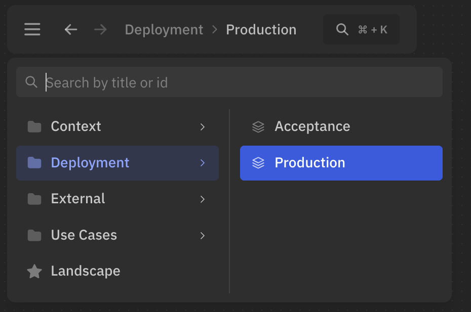

import { Aside, Tabs, TabItem } from '@astrojs/starlight/components';

Você pode organizar as visões em pastas para manter o workspace limpo e fácil de navegar.

## Criar pastas

Para criar uma pasta, use `/` no título.  
Por exemplo, a visão abaixo terá o título `Production` e ficará aninhada na pasta `Deployment`:

```likec4
views {
  view {
    title 'Deployment / Production'    
  }
}
```

Na interface, essa visão será exibida assim:



:::note
Se um título precisar conter `/` sem criar uma pasta, faça o escape com uma barra invertida:

```likec4
views {
  view {
    title 'Cost \/ Benefit'
  }
}
```

Essa visão mantém o título único `Cost / Benefit` e não fica aninhada em uma pasta `Cost`.
O mesmo escape funciona para títulos de elementos, o que é útil quando `implicitViews` está habilitado e uma
visão gerada automaticamente seria dividida em uma subpasta indesejada.
:::

## Ordenar visões

Visões na mesma pasta podem ser ordenadas com `order` seguido de um inteiro não negativo.
As visões com uma ordem explícita aparecem primeiro, em ordem crescente. Visões com a mesma ordem e visões sem uma ordem mantêm a ordem de declaração.
As pastas continuam sendo ordenadas alfabeticamente.

```likec4
views {
  view api {
    title 'Services / API'
    order 1
  }

  dynamic view checkout {
    title 'Services / Checkout flow'
    order 2
  }

  deployment view production {
    title 'Services / Production'
  }
}
```

As visões podem ser definidas no mesmo arquivo, mas colocadas em pastas diferentes:

```likec4
views {
  dynamic view {
    title 'Use Cases / 16.2 Checkout / Checkout flow'    
  }

  deployment view {
    title 'Deployments / Staging / Checkout microservice'    
  }
}
```

## Pasta comum

Você pode especificar uma pasta comum para o bloco `views`.  
Toda visão definida dentro dele será colocada nessa pasta:

```likec4 "'Domain 1 / Subdomain'"
// Common folder for all views in the block
views 'Domain 1 / Subdomain' {

  view {
    // Will be displayed as 'Domain 1 / Subdomain / Landscape'
    title 'Landscape'  
  }
  
  dynamic view {
    // You can add nested folder  
    // Will be displayed as 'Domain 1 / Subdomain / Use Cases / 16.2 Checkout'
    title 'Use Cases / 16.2 Checkout'    
  }
}
```
