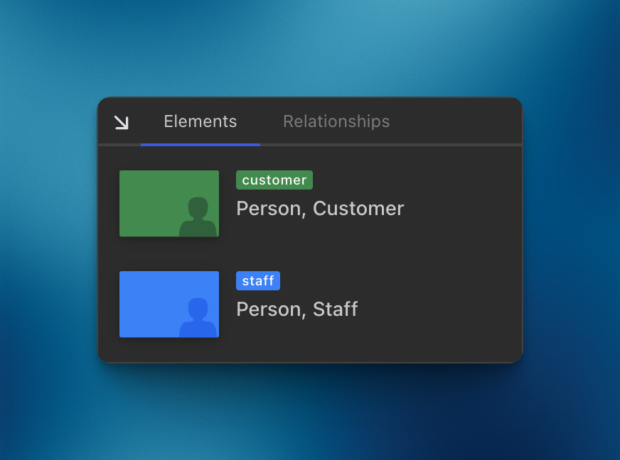

import { Card, Aside } from '@astrojs/starlight/components';
import LikeC4ThemeView from '@components/likec4-theme/LikeC4ThemeView.astro';

<Aside type='caution' title="Experimental">
  A implementação é experimental e pode mudar no futuro.
  O objetivo principal é coletar feedback, sugestões e ideias.
</Aside>

<Aside type='caution' title="Em andamento">
  Notações de relacionamentos estão em andamento.
</Aside>

Notações de visões (ou chave/legenda) fornecem informações sobre os significados das formas e dos estilos.
É importante fornecer uma chave que explique a diferença entre cores e formas.

É possível definir notações globais (por tipo de elemento) e locais (por visão).

#### Notações globais

Como o nome indica, notações globais se aplicam a todas as visões e são definidas no bloco `specification`:

```likec4 copy {4, 12}
specification {

  element customer {
    notation "Person, Customer"
    style {
      shape person
      color green
    }
  }

  element staff {
    notation "Person, Staff"
    style {
      shape person
    }
  }
}
```

As notações serão aplicadas a todas as visões com esses elementos e exibidas assim:

<div style="max-width:400px;margin: 1rem auto">

</div>

Exemplo ao vivo.
Expanda a visão a seguir e clique no ícone de ajuda no canto inferior direito:

<LikeC4ThemeView viewId="notations_example"/>

#### Notações locais

Notações locais sobrescrevem as globais e se aplicam a uma visão específica.

##### Com predicado de estilo

Quando você altera o estilo, pode adicionar uma notação para explicar o significado:

```likec4
view {

  style webApp1, webApp2 {
    notation "Application under development"
    color amber
  }

  style element.tag = #deprecated {
    notation "Deprecated"
    color muted
  }

}
```

As notações não são mescladas nem agrupadas; a última será aplicada.

:::tip

Você pode ter a mesma notação para estilos diferentes:

```likec4
view {

  style webApp1 {
    notation "Web Application"
    color amber
  }

  style webApp2 {
    notation "Web Application"
    color green
  }
}
```
:::

##### Com sobrescritas

Defina a notação ao incluir elementos:

```likec4
view {

  include *
    where kind is microservice
      and tag is #deprecated
      with {
        notation "Deprecated microservice"
        shape rectangle
        color muted
      }

}
```

Essa sobrescrita tem a prioridade mais alta; depois vêm as notações definidas em predicados de estilo e, por fim, as notações globais.

:::note
Compartilhe suas ideias nas <a href="https://github.com/likec4/likec4/discussions/" target='_blank'>GitHub discussions</a> sobre como melhorar notações e torná-las reutilizáveis ou mais flexíveis.
:::
