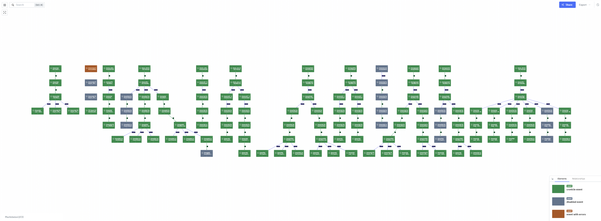

Ao lidar com milhares de tarefas agendadas e fluxos de trabalho complexos, é fácil se perder entre logs, identificadores e dashboards.  
Um membro da comunidade compartilhou um caso de uso que demonstra como o LikeC4 ajuda a compreender esse cenário de forma visual, clara e em tempo real.

> _"Meu sistema de agendamento define aproximadamente 1.700 tarefas, algumas agrupadas em fluxos de trabalho complexos. Como o agendador não oferece visualização, usei o LikeC4 para gerar diagramas interativos, atualizados em tempo real e conectados aos nossos sistemas."_

## De agendamentos a diagramas de sistemas

A equipe compartilhou uma solução simples e eficaz:

- Um **script Python** obtém as definições de tarefas e fluxos de trabalho por meio da API REST do agendador.
- Essas definições são convertidas automaticamente em **modelos e visões LikeC4**.
- Uma conexão WebSocket fornece *atualizações de estado em tempo real*: em execução, concluído com sucesso, falha e desativado.
- O script atualiza o modelo dinamicamente. O LikeC4 detecta as alterações e utiliza HMR (*hot module replacement*) para atualizar o diagrama em tempo real.
- Cada elemento do diagrama contém um link direto para a interface do agendador.

_**O resultado?**_

Um mapa dinâmico dos fluxos de trabalho e estados das tarefas, permitindo identificar rapidamente erros, dependências e caminhos críticos.

> _"Conseguimos identificar imediatamente onde ocorrem os erros e navegar diretamente do diagrama para a tarefa na interface do agendador. Isso nos ajuda muito."_

 

## Próximos passos: visualizar mais do que tarefas

Essa solução já economiza tempo da equipe e reduz a carga cognitiva.  
Os próximos passos previstos ampliam ainda mais as possibilidades:

- **Dependências externas:** destacar as tarefas que interagem com servidores FTP, APIs externas ou sistemas de arquivos.
- **Linhagem de dados:** acompanhar quais tarefas fornecem dados para outras, formando pipelines em tempo real.
- **Responsabilidade:** identificar nos nós as equipes responsáveis ou os proprietários dos serviços.
- **Trilhas de auditoria:** apresentar o histórico de alterações na estrutura das tarefas e nas dependências.
- **Resposta a incidentes:** utilizar indicadores de estado em tempo real para facilitar a investigação de problemas nos dashboards.

## Crie sua própria camada de observabilidade visual

O diferencial do LikeC4 é transformar definições abstratas de sistemas em modelos estruturados e visuais que são atualizados em tempo real.
Isso vai além da documentação de arquitetura: também oferece visibilidade operacional.

Se você gerencia fluxos de trabalho e tarefas, DAGs do Airflow, pipelines de CI ou microsserviços com interações imprevisíveis, o LikeC4 pode ser a camada de visibilidade que estava faltando.
