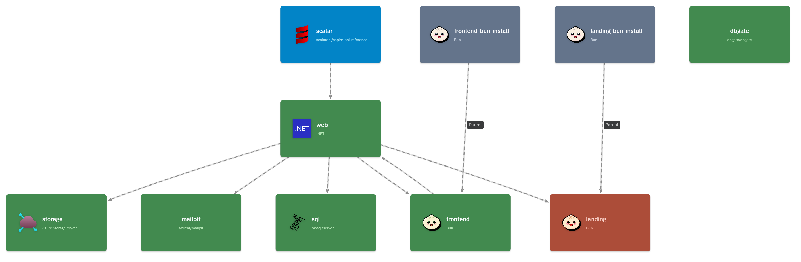
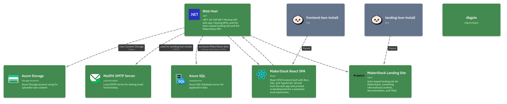

import { CardGrid, LinkCard, TabItem, Tabs } from '@astrojs/starlight/components';

:::caution[Projeto da comunidade]
O AspireC4 é mantido pela comunidade e não é um pacote oficial do LikeC4. As APIs e o comportamento podem mudar.
:::

O [AspireC4](https://github.com/kjldev/aspirec4) é uma biblioteca de extensão para .NET Aspire que gera automaticamente diagramas de arquitetura LikeC4 a partir do grafo de recursos do Aspire. Os diagramas são atualizados em tempo real quando os recursos iniciam, param ou apresentam erros. Cada elemento também inclui um link para a página correspondente no dashboard do Aspire.

<CardGrid>
  <LinkCard title="GitHub" href="https://github.com/kjldev/aspirec4" />
  <LinkCard title="Pacote NuGet" href="https://www.nuget.org/packages/AspireC4.Hosting/" />
  <LinkCard title="Projeto" href="https://kjl.dev/projects/aspirec4" />
</CardGrid>

## Pré-requisitos

- **Docker** (necessário por padrão) — o servidor LikeC4 é executado em um contêiner auxiliar (*sidecar*) com a imagem `ghcr.io/likec4/likec4`.
- Como alternativa, utilize `.WithLocalCLI()` para executar com uma CLI Node.js instalada localmente (`npx`, `pnpm`, `yarn`, `bun` ou `deno`).

## Início rápido

Adicione `AspireC4.Hosting` ao projeto AppHost e chame `AddAspireC4()`:

```csharp
// AppHost/Program.cs
var builder = DistributedApplication.CreateBuilder(args);

// Add your services ...
var api = builder.AddProject<Projects.MyApi>("my-api");

// Register the LikeC4 visualization sidecar.
builder.AddAspireC4();

builder.Build().Run();
```

Isso irá:

1. Gerar o arquivo `./likec4/model.gen.c4` a partir do grafo de recursos do Aspire.
2. Iniciar um contêiner Docker `ghcr.io/likec4/likec4` para disponibilizar o diagrama atualizado.
3. Monitorar alterações de estado dos recursos e regenerar o arquivo automaticamente.

<Tabs>
  <TabItem label="Configuração básica">
    Isso adiciona a extensão de hospedagem do AspireC4 ao construtor do AppHost.    

    ```csharp
    // AppHost/Program.cs
    var builder = DistributedApplication.CreateBuilder(args);
    builder.AddAspireC4();

    // ...add other projects/resources such as databases, services, etc.

    builder
      .AddProject<Projects.Web>("web")
      .WithReference(db);    
    ```

    
  </TabItem>
  <TabItem label="Configuração avançada">
    This simply adds the AspireC4 hosting extension to the AppHost builder.    

    ```csharp
    // AppHost/Program.cs
    var builder = DistributedApplication.CreateBuilder(args);
    builder.AddAspireC4(opts => {
      opts.Title = "MakerStack Architecture";
    });

    // ...add other projects/resources such as databases, services, etc.

    builder
      .AddProject<Projects.Web>("web")
      .WithLikeC4Details(opts => {
        opts
          .WithLabel("Web Host")
          .WithSummary(".NET 10/ ASP.NET Minimal API web app. Hosting APIs, and the Astro-based landing site and the MarkerStack SPA");
      })
      # Note the reference to the database resource (db) here, to save you from calling .WithReference(db) as well...
      .WithLikeC4Reference(db, opts => {
        opts
          .WithLabel("Tabular Data Stream (TDS)")
          ... etc
      });
    ```

    
  </TabItem>
</Tabs>


## Como funciona

### Fluxo de dados

```
Aspire resources
     │
     ▼
LikeC4ModelBuilder.Build()   ← resource states, dashboard URL
     │
     ▼
LikeC4DSLGenerator.Generate()
     │
     ▼
./likec4/model.gen.c4         ← written to disk (and Docker volume)
     │
     ▼
ghcr.io/likec4/likec4        ← serves the diagram, hot-reloads on file change
```

### Cores dos estados dos recursos

Cada recurso do Aspire é representado por um elemento LikeC4. A cor indica o estado atual em tempo de execução:

| Estado | Cor | Descrição |
|-------|-------|-------------|
| Desconhecido | default | Ainda não iniciado |
| Iniciando | sky | O recurso está inicializando |
| Em execução | green | Saudável e em funcionamento |
| Parando | slate | Em processo de parada (60% de opacidade) |
| Encerrado | muted | Encerrado normalmente (30% de opacidade) |
| Falha | amber | Encerrado com código diferente de zero |
| Erro | red | Foi reportado um estado de erro |

{/* Espaço reservado para captura de tela: diagrama LikeC4 com recursos em diferentes estados */}

## Links diretos para o dashboard

Quando `IncludeAspireDashboardLinks` está habilitado (comportamento padrão), cada elemento LikeC4 recebe dois links:

- **Dashboard: logs de console** → `/consolelogs/resource/{name}`
- **Dashboard: logs estruturados** → `/structuredlogs/resource/{name}`

Os links são criados em tempo de execução quando o dashboard do Aspire atinge o estado `Running`. Se houver um token de acesso pelo navegador (configuração padrão do Aspire), ele será incorporado aos links para permitir a autenticação sem interrupções.

Para desabilitar os links do dashboard:

```csharp
builder.AddAspireC4(options =>
{
    options.IncludeAspireDashboardLinks = false;
});
```


## Modos alternativos

### CLI local (`WithLocalCLI`)

Utiliza uma CLI `likec4` instalada localmente (via `npx`/`pnpm`/`yarn`/`bun`/`deno`) em vez do contêiner Docker:

```csharp
builder.AddAspireC4().WithLocalCLI();
```

### Ocultar do dashboard (`WithHideFromDashboard`)

Remove o sidecar do LikeC4 da lista de recursos do dashboard do Aspire e disponibiliza a URL do diagrama como link e comando em cada `ProjectResource`:

```csharp
builder.AddAspireC4().WithHideFromDashboard();
```

## Exclusão de recursos

Um recurso é excluído do diagrama quando:

- Possui uma anotação `ExcludeFromLikeC4Annotation`; ou
- Tem `ResourceSnapshotAnnotation.InitialSnapshot.IsHidden == true` (recursos internos do Aspire).

O próprio recurso sidecar do LikeC4 sempre é excluído.

## Limitações

- **Ferramenta de diagramas estáticos**: o LikeC4 renderiza um diagrama com base em arquivo. As atualizações de estado exigem uma atualização via HMR.
- **Descoberta da URL do dashboard**: se o dashboard do Aspire ainda não estiver iniciado quando o primeiro diagrama for gerado, os links só aparecerão quando ele atingir `Running` e acionar uma nova geração.
- **Token de acesso no arquivo gerado**: o token de acesso pelo navegador do Aspire aparece no arquivo `.c4`, incorporado às URLs do dashboard. Não faça commit do arquivo gerado no controle de versão.
- **Relay HMR no Windows**: no Windows, um relay TCP conecta a porta fixa `24678` do host à porta Docker alocada dinamicamente para Hot Module Replacement.
