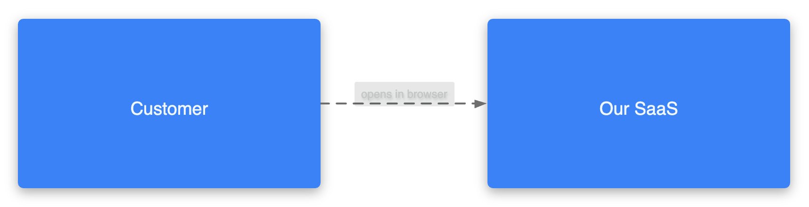
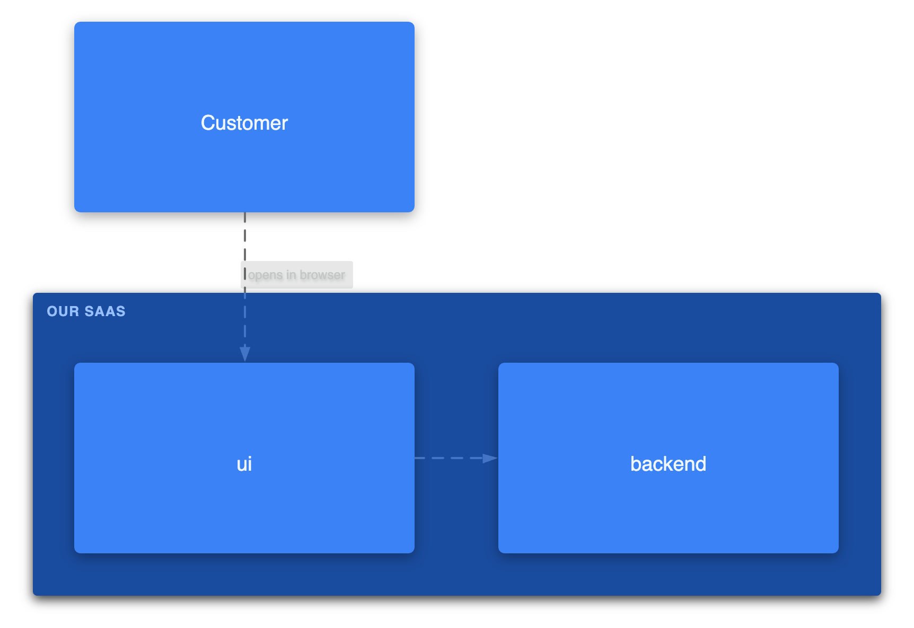
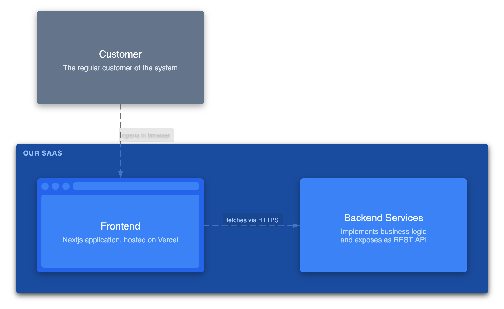
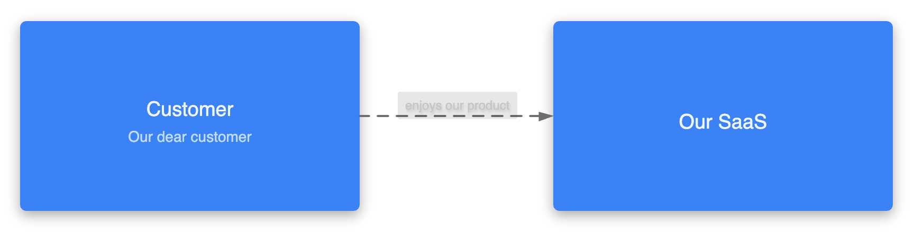
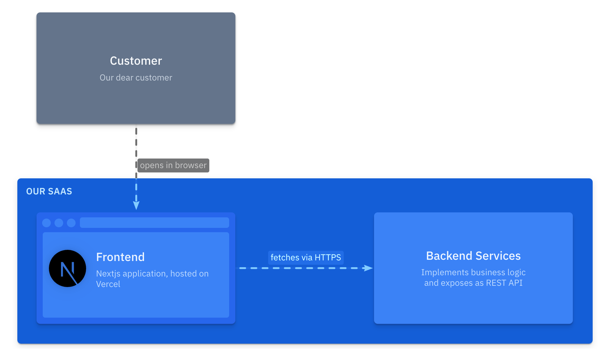

import { Steps, LinkCard } from '@astrojs/starlight/components';
import { Aside } from '@astrojs/starlight/components';

Para iniciar o tutorial, você tem duas opções:
- Abra o <a href="https://playground.likec4.dev/w/blank/" target='_blank'>Playground vazio</a> em uma nova aba
- Instale a [extensão para VS Code](https://marketplace.visualstudio.com/items?itemName=likec4.likec4-vscode) (ou pelo <a href="https://open-vsx.org/extension/likec4/likec4-vscode" target="_blank">Open VSX</a>) e crie um novo arquivo com a extensão `.c4`

Depois, siga estas etapas:

<Steps>

1. ##### Preparar a especificação

    Vamos começar definindo os tipos de elementos que existirão em nossa arquitetura.
    Precisamos apenas de dois: `actor` e `system`:

    ```likec4 copy
    // tutorial.c4
    specification {
      element actor
      element system
    }
    ```

2. ##### Criar o modelo

    Comece pelos elementos de nível superior e defina o modelo:

    ```diff lang="likec4"
    // tutorial.c4
     specification {
       element actor
       element system
     }

    + model {
    +   customer = actor 'Customer'
    +   saas = system 'Our SaaS'
    + }
    ```

    Estes são os primeiros elementos do nosso modelo de arquitetura.  
    Agora vamos adicionar mais detalhes.

3. ##### Adicionar uma hierarquia

    Considere que nosso sistema possui dois componentes principais: `ui` e `backend`.
    Vamos adicionar um novo tipo à especificação e atualizar o modelo.

    ```diff lang="likec4" {5,11-12} copy
    // tutorial.c4
    specification {
      element actor
      element system
    +  element component
    }

    model {
      customer = actor 'Customer'
      saas = system 'Our SaaS' {
    +    component ui
    +    component backend
      }
    }
    ```    

4. ##### Adicionar relacionamentos

    **Qualquer ligação** entre elementos — por exemplo, interações, chamadas, delegações, dependências ou fluxos — pode ser representada como um relacionamento.
    Você pode defini-los da forma que fizer mais sentido para o seu modelo.

    No modelo:

    ```diff lang="likec4" {14-15,18-19} copy
    // tutorial.c4
    specification {
      element actor
      element system
      element component
    }

    model {
      customer = actor 'Customer'
      saas = system 'Our SaaS' {
        component ui
        component backend

    +    // UI fetches data from the Backend
    +    ui -> backend
      }

    +  // Customer uses the UI
    +  customer -> ui 'opens in browser'
    }
    ```

5. ##### Criar o primeiro diagrama

    Os diagramas são renderizados a partir de visões (*views*). As visões são projeções do modelo definidas por predicados, que determinam o que deve ser incluído ou excluído.

    Comece com uma visão panorâmica (*"Landscape"*):

    ```diff lang="likec4" {23-25} copy
    // tutorial.c4
    specification {
      element actor
      element system
      element component
    }

    model {
      customer = actor 'Customer'
      saas = system 'Our SaaS' {
        component ui
        component backend

        // UI fetches data from the Backend
        ui -> backend

        // Customer uses the UI
        customer -> ui 'opens in browser'
      }
    }

    views {
    +  view index {
    +    include *
    +  }
    }
    ```    

    O resultado é este:

    

    <Aside title='Por que há um relacionamento?'>
    O predicado `include *` inclui apenas os elementos de "nível superior" e infere os relacionamentos entre eles a partir dos elementos aninhados:
    > `customer` possui um _relacionamento conhecido_ com o elemento aninhado `saas.ui`

    Isso implica que:  
    > `customer` possui _algum relacionamento_ com `saas`.  

    </Aside>


6. ##### Adicionar mais visões

    ```diff lang="likec4" {27-29}
    // tutorial.c4
    specification {
      element actor
      element system
      element component
    }

    model {
      customer = actor 'Customer'
      saas = system 'Our SaaS' {
        component ui
        component backend

        // UI requests data from the Backend
        ui -> backend

        // Customer uses the UI
        customer -> ui 'opens in browser'
      }
    }

    views {
      view index {
        include *
      }

    +  view of saas {
    +    include *
    +  }
    }
    ```

    Imagine que aproximamos o foco no elemento `saas` para visualizar seus elementos aninhados e os relacionamentos entre eles:

    

7. ##### Enriquecer o modelo

    Vamos adicionar descrições, definir a forma (*shape*) do `ui` e incluir um rótulo no relacionamento `ui -> backend`.

    ```diff lang="likec4" {10,15-19,22-25,29,47-49} ins="'fetches via HTTPS'" copy
    // tutorial.c4
    specification {
      element actor
      element system
      element component
    }

    model {
      customer = actor 'Customer' {
    +    description 'The regular customer of the system'
      }

      saas = system 'Our SaaS' {
        component ui 'Frontend' {
    +      description 'Nextjs application, hosted on Vercel'
    +      style {
    +        icon tech:nextjs  
    +        shape browser
    +      }
        }
        component backend 'Backend Services' {
    +      description '
    +        Implements business logic
    +        and exposes as REST API
    +      '
        }

        // UI fetches data from the Backend
        ui -> backend 'fetches via HTTPS'
      }

      // Customer uses the UI
      customer -> ui 'opens in browser'
    }

    views {

      view index {
        title 'Landscape view'

        include *
      }

      view of saas {
        include *

    +    style customer {
    +      color muted
    +    }
      }

    }
    ```

    A visão `saas` após as alterações:

    

8. ##### Fazer alterações no modelo

    Vamos alterar a descrição de `customer` e o rótulo do relacionamento `customer -> ui`.

    ```diff lang="likec4"
    // tutorial.c4
    specification {
      element actor
      element system
      element component
    }

    model {
      customer = actor 'Customer' {
    -    description 'The regular customer of the system'        
    +    description 'Our dear customer'
      }

      saas = system 'Our SaaS' {
        component ui 'Frontend' {
          description 'Nextjs application, hosted on Vercel'
          style {
            icon tech:nextjs
            shape browser
          }
        }
        component backend 'Backend Services' {
          description '
            Implements business logic
            and exposes as REST API
          '
        }

        // UI requests data from the Backend
        ui -> backend 'fetches via HTTPS'
      }

      // Customer uses the UI
      customer -> ui 'opens in browser'
    +  customer -> saas 'enjoys our product'
    }

    views {

      view index {
        title 'Landscape view'

        include *
      }

      view of saas {
        include *

        style customer {
          color muted
        }
      }

    }
    ```

    Visão `index`:

    

    Visão `saas`:

    

    :::tip[Percebeu?]
    Alteramos elementos no modelo e todas as visões foram atualizadas de acordo com essas mudanças.
    :::

9. ##### Experimente você mesmo

    Explore [este tutorial no Playground](https://playground.likec4.dev/w/tutorial/) e tente fazer o seguinte:

    - altere a forma ([`shape`](/pt-br/dsl/styling/#single-element)) do elemento `customer`
    - adicione um banco de dados (usando a forma `storage`) e tabelas como `customers` e `orders` — quais relacionamentos deveriam ser adicionados?
    - adicione um sistema externo, como o Stripe, e mostre como o backend poderia interagir com ele

    <LinkCard
      title="Abrir o Playground"
      description="Experimente este tutorial diretamente no Playground"
      href="https://playground.likec4.dev/w/tutorial/"
      target="_blank"
    />

</Steps>
