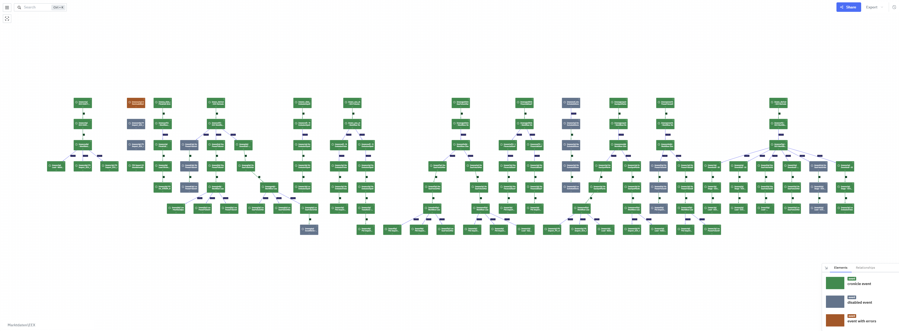

When you're dealing with thousands of scheduled jobs and complex workflows, it's easy to get lost in logs, IDs, and dashboards.  
One of our community members recently shared a brilliant use case that shows how LikeC4 can make sense of it all - visually, clearly, and in real time.

> _"My scheduling system defines ~1700 jobs, some of which are combined into complex workflows. The scheduler lacks visualization, so I used LikeC4 to generate interactive diagrams - live and linked to our systems."_

## From Schedules to Systems Diagrams

Guys shared their setup, which is clean and powerful:

- A **Python script** pulls job/workflow definitions from a scheduler's REST API.
- These are turned into **LikeC4 models and views**, automatically.
- A WebSocket stream delivers *live status updates*: running, successful, failed, deactivated.
- The script updates the model on the fly, likec4 picks up the changes and with HMR (hot module replacement) the diagram is updated in real time.
- Each element in the diagram links directly back to the scheduler software UI.

_**The result?**_

A living, breathing map of workflows and job states  -  with errors, dependencies, and critical paths clearly visible at a glance.

> _"We can immediately see where errors are, and jump straight from the graph to the job in our scheduler UI. This helps us immensely."_

 

## What's Next? Visualizing More than Just Jobs

This setup is already saving time for the team and reducing cognitive load.  
But their roadmap is even more exciting:

- **External dependencies:** Highlight which jobs interact with FTP servers, external APIs, or file systems.
- **Data lineage:** Track which jobs feed data into others, forming real-time pipelines.
- **Ownership & responsibility:** Annotate nodes with responsible teams or service owners.
- **Audit trails:** Show historical changes in job structures and dependencies over time.
- **Incident response:** Use live job status overlays for real-time troubleshooting dashboards.

## Build Your Own Visual Operations Layer

The power of LikeC4 lies in turning abstract system definitions into structured, visual models that update in real time.
This isn't just architecture documentation - it's operational visibility.

If you're managing workflow and jobs, Airflow DAGs, CI pipelines, or microservices with unpredictable interactions - LikeC4 might be the visibility layer you didn't know you needed.
