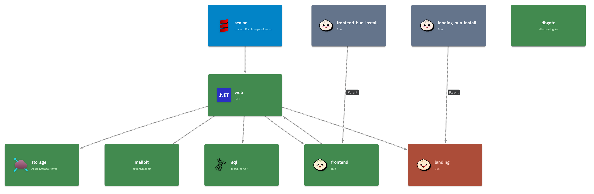
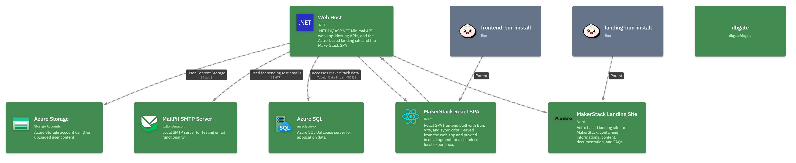

import { CardGrid, LinkCard, TabItem, Tabs } from '@astrojs/starlight/components';

:::caution[Community Project]
AspireC4 is a community-maintained project, not an official LikeC4 package. APIs and behavior may change.
:::

[AspireC4](https://github.com/kjldev/aspirec4) is a .NET Aspire extension library that auto-generates live LikeC4 architecture diagrams from the Aspire resource graph. Diagrams update in real-time as resources start, stop, or produce errors — and each element links back to the corresponding Aspire dashboard page.

<CardGrid>
  <LinkCard title="GitHub" href="https://github.com/kjldev/aspirec4" />
  <LinkCard title="NuGet Package" href="https://www.nuget.org/packages/AspireC4.Hosting/" />
  <LinkCard title="Project" href="https://kjl.dev/projects/aspirec4" />
</CardGrid>

## Prerequisites

- **Docker** (required by default) — the LikeC4 server runs as a `ghcr.io/likec4/likec4` container sidecar.
- Alternatively, use `.WithLocalCLI()` to run via a locally-installed Node.js CLI (`npx`, `pnpm`, `yarn`, `bun`, or `deno`).

## Quick Start

Add `AspireC4.Hosting` to your AppHost project, then call `AddAspireC4()`:

```csharp
// AppHost/Program.cs
var builder = DistributedApplication.CreateBuilder(args);

// Add your services ...
var api = builder.AddProject<Projects.MyApi>("my-api");

// Register the LikeC4 visualization sidecar.
builder.AddAspireC4();

builder.Build().Run();
```

This will:

1. Write a `./likec4/model.gen.c4` file from the Aspire resource graph.
2. Start a `ghcr.io/likec4/likec4` Docker container serving the live diagram.
3. Watch for resource state changes and regenerate the file automatically.

<Tabs>
  <TabItem label="Basic Setup">
    This simply adds the AspireC4 hosting extension to the AppHost builder.    

    ```csharp
    // AppHost/Program.cs
    var builder = DistributedApplication.CreateBuilder(args);
    builder.AddAspireC4();

    // ...add other projects/resources such as databases, services, etc.

    builder
      .AddProject<Projects.Web>("web")
      .WithReference(db);    
    ```

    
  </TabItem>
  <TabItem label="Enhanced Setup">
    This simply adds the AspireC4 hosting extension to the AppHost builder.    

    ```csharp
    // AppHost/Program.cs
    var builder = DistributedApplication.CreateBuilder(args);
    builder.AddAspireC4(opts => {
      opts.Title = "MakerStack Architecture";
    });

    // ...add other projects/resources such as databases, services, etc.

    builder
      .AddProject<Projects.Web>("web")
      .WithLikeC4Details(opts => {
        opts
          .WithLabel("Web Host")
          .WithSummary(".NET 10/ ASP.NET Minimal API web app. Hosting APIs, and the Astro-based landing site and the MarkerStack SPA");
      })
      # Note the reference to the database resource (db) here, to save you from calling .WithReference(db) as well...
      .WithLikeC4Reference(db, opts => {
        opts
          .WithLabel("Tabular Data Stream (TDS)")
          ... etc
      });
    ```

    
  </TabItem>
</Tabs>


## How It Works

### Data Flow

```
Aspire resources
     │
     ▼
LikeC4ModelBuilder.Build()   ← resource states, dashboard URL
     │
     ▼
LikeC4DSLGenerator.Generate()
     │
     ▼
./likec4/model.gen.c4         ← written to disk (and Docker volume)
     │
     ▼
ghcr.io/likec4/likec4        ← serves the diagram, hot-reloads on file change
```

### Resource State Colors

Each Aspire resource is represented as a LikeC4 element. Its color reflects the live runtime state:

| State | Color | Description |
|-------|-------|-------------|
| Unknown | default | Not yet started |
| Starting | sky | Resource is initializing |
| Running | green | Healthy and running |
| Stopping | slate | Winding down (60% opacity) |
| Exited | muted | Stopped cleanly (30% opacity) |
| Failed | amber | Exited with a non-zero code |
| Error | red | Reported an error state |

{/* Screenshot placeholder: LikeC4 diagram showing resources in various states */}

## Dashboard Deep-Links

When `IncludeAspireDashboardLinks` is enabled (the default), each LikeC4 element receives two links:

- **Dashboard: Console Logs** → `/consolelogs/resource/{name}`
- **Dashboard: Structured Logs** → `/structuredlogs/resource/{name}`

Links are built at runtime once the Aspire dashboard reaches the `Running` state. With a browser token (default Aspire setup), the links embed the token for seamless authentication.

To disable dashboard links:

```csharp
builder.AddAspireC4(options =>
{
    options.IncludeAspireDashboardLinks = false;
});
```


## Alternative Modes

### Local CLI (`WithLocalCLI`)

Uses a locally-installed `likec4` CLI (via `npx`/`pnpm`/`yarn`/`bun`/`deno`) instead of the Docker container:

```csharp
builder.AddAspireC4().WithLocalCLI();
```

### Hide from Dashboard (`WithHideFromDashboard`)

Removes the LikeC4 sidecar from the Aspire dashboard resource list and surfaces the diagram URL as a link and command on each `ProjectResource`:

```csharp
builder.AddAspireC4().WithHideFromDashboard();
```

## Excluding Resources

A resource is excluded from the diagram if:

- It carries an `ExcludeFromLikeC4Annotation`, or
- Its `ResourceSnapshotAnnotation.InitialSnapshot.IsHidden == true` (Aspire internal resources).

The LikeC4 sidecar resource itself is always excluded.

## Limitations

- **Static diagram tool**: LikeC4 renders a file-based diagram. State updates require an HMR refresh.
- **Dashboard URL discovery**: If the Aspire dashboard hasn't started when the first diagram is generated, dashboard links will be absent until it reaches `Running` and triggers a regeneration.
- **Browser token in generated file**: The Aspire browser token appears in the `.c4` file embedded in dashboard link URLs. Do not commit the generated file to source control.
- **Windows HMR relay**: On Windows, a TCP relay bridges the fixed host port `24678` to the dynamically-allocated Docker port for Hot Module Replacement.
