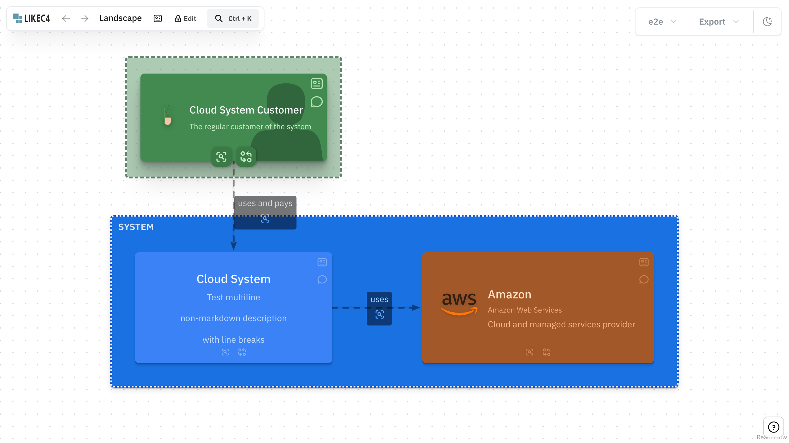
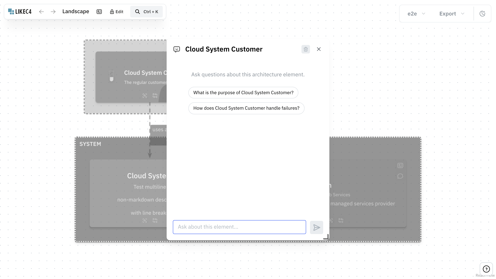
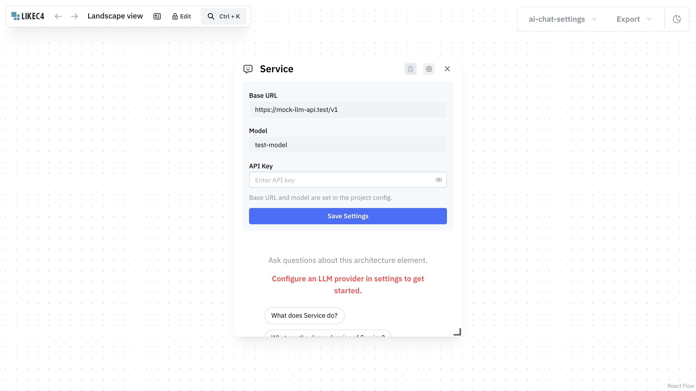
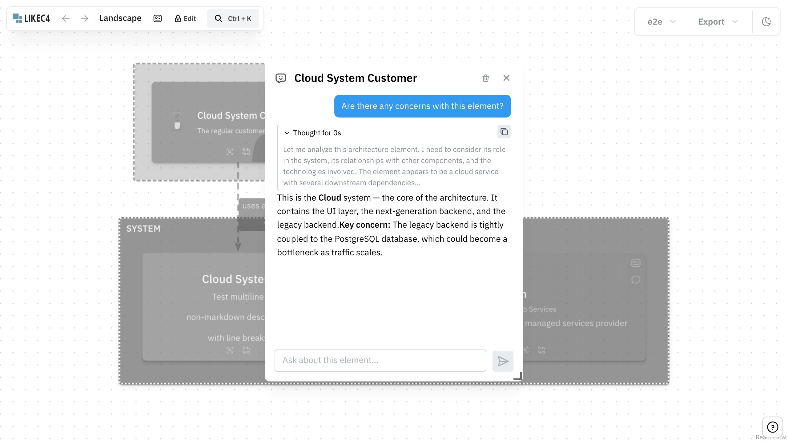

import { Aside, LinkCard } from '@astrojs/starlight/components';

AI Chat is an interactive overlay that lets you ask questions about architecture elements directly from diagrams.
Click the chat icon on any element to open a contextual chat window.





## How it works

When you open AI Chat on an element, LikeC4 automatically assembles a rich context from your model and sends it to the configured LLM along with your question. The context includes:

- **Project information** — title, contact person, metadata
- **Element details** — kind, technology, description, summary, tags, links, metadata
- **Relationships** — incoming and outgoing relationships with their metadata and links
- **Hierarchy** — parent and children elements
- **Current view** — view title, type, description, links
- **Other views** — additional views where the element appears

## Configuration

AI Chat requires an OpenAI-compatible API endpoint. Add the `aiChat` section to your [project config](/dsl/config/#ai-chat):

```jsonc
{
  "$schema": "https://likec4.dev/schemas/config.json",
  "name": "my-project",
  "aiChat": {
    "baseUrl": "https://api.openai.com/v1",
    "model": "gpt-4o",
    "apiKey": "sk-..."
  }
}
```

Any OpenAI-compatible endpoint works — OpenAI, Azure OpenAI, NVIDIA NIM, Ollama, vLLM, LiteLLM, etc.

<Aside type="tip">
  When no project-level config is provided, users can configure the LLM provider manually via the settings icon in the chat window. This uses browser localStorage.
</Aside>



### Static builds and API keys

By default, the API key is **stripped** from static builds (`likec4 build`) to prevent exposing secrets in client-side bundles. Users must then configure the provider manually in the chat settings.

To include the API key in the build (e.g. for internal/private deployments):

```jsonc
{
  "aiChat": {
    "baseUrl": "https://api.openai.com/v1",
    "model": "gpt-4o",
    "apiKey": "sk-...",
    "allowUnsafeApiKey": true
  }
}
```

<Aside type="caution">
  With `allowUnsafeApiKey: true`, the API key is embedded in the generated JavaScript bundle. Anyone with access to the deployed site can extract it. Only use this for internal deployments.
</Aside>

## Template variables

Both `systemPrompt` and `suggestedQuestions` support template variables that are replaced with values from the current element and view. Use `{variableName}` syntax:

| Variable | Description | Example value |
|----------|-------------|---------------|
| `{title}` | Element name | `Cloud Customer` |
| `{kind}` | Element kind | `service` |
| `{technology}` | Technology | `Node.js` |
| `{parent}` | Parent element name | `Cloud System` |
| `{tags}` | Comma-separated tags | `critical, public-facing` |
| `{view}` | Current view title | `Landscape` |
| `{dependencies}` | Outgoing relationship targets | `Backend API, Amazon SQS` |
| `{dependents}` | Incoming relationship sources | `API Gateway, Load Balancer` |
| `{context}` | Full architecture context block | _(project, element, relationships, views)_ |

Variables that don't match a known name (e.g. `{unknown}`) are left as-is.

**Behavior differs by usage:**
- **System prompt** — empty variables are replaced with an empty string. The prompt is always sent.
- **Suggested questions** — if any variable in a question is empty (e.g. the element has no technology), that question is hidden.

## Custom system prompt

By default, LikeC4 uses a built-in system prompt that instructs the LLM to act as an architecture assistant. You can replace it with your own:

```jsonc
{
  "aiChat": {
    "systemPrompt": "You are a security reviewer for {title} ({kind}).\n\n{context}\n\nFocus on identifying security risks, compliance issues, and attack surface."
  }
}
```

Use `{context}` to inject the full architecture context (project info, element details, relationships, etc.). If `{context}` is omitted, the architecture context will not be included.

## Custom suggested questions

The empty chat state shows suggested questions users can click. By default these are generic architecture questions, but you can customize them:

```jsonc
{
  "aiChat": {
    "suggestedQuestions": {
      "element": [
        "What is the purpose of {title}?",
        "Is {technology} the right choice for {title}?",
        "What are the risks of {title} depending on {dependencies}?"
      ]
    }
  }
}
```

Questions referencing empty variables are automatically hidden. For example, `"Is {technology} the right choice?"` won't appear for elements without a technology set.

## Reasoning models

AI Chat supports models that produce reasoning/thinking tokens (e.g. OpenAI o-series, NVIDIA reasoning endpoints). When a model emits reasoning content, it is displayed in a collapsible block above the response:

- **During streaming** — the reasoning block auto-expands with a "Thinking..." label and elapsed timer
- **After completion** — it auto-collapses to a single "Thought for Xs" line that can be expanded on click



No special configuration is needed — reasoning detection is automatic based on the model's response format.

<LinkCard title="Full configuration reference" href="/dsl/config/#ai-chat" description="All aiChat options in likec4.config.json" />

<LinkCard title="MCP Server" href="/tooling/mcp/" description="For IDE-level LLM integration with your architecture model, see the MCP Server" />
