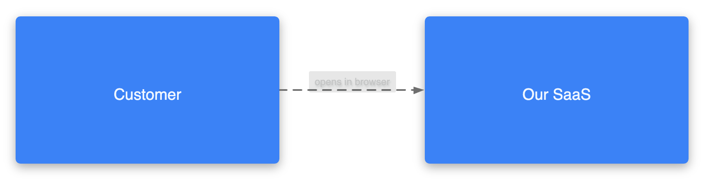
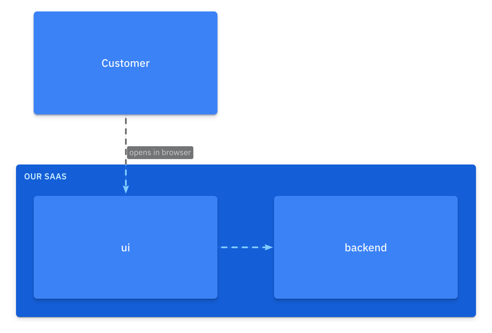
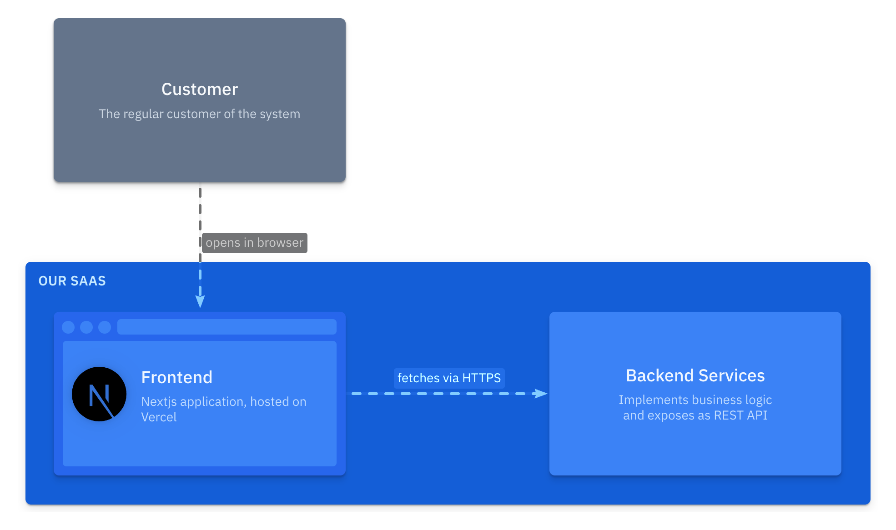

import { Steps } from '@astrojs/starlight/components';
import { Aside } from '@astrojs/starlight/components';

To start with the tutorial there are two options:
- Web: open blank playground in a new tab
- Local: [install vscode extension](https://marketplace.visualstudio.com/items?itemName=likec4.likec4-vscode)

and follow the steps:

<Steps>

1. ##### Prepare specification

    We start with defining kinds of the elements in our architecture.  
    We need only two - `actor` and `system`:

    ```likec4 copy
    // tutorial.c4
    specification {
      element actor
      element system
    }
    ```

2. ##### Create model

    Start with top-level and define the model:

    ```diff lang="likec4"
    // tutorial.c4
     specification {
       element actor
       element system
     }

    + model {
    +   customer = actor 'Customer'
    +   saas = system 'Our SaaS'
    + }
    ```

    These are the first elements of our architecture model.  
    Let's add details.

3. ##### Add hierarchy

    Assume our system has two main components - `ui` and `backend`.  
    We add a new kind to the specification and update the model.

    ```diff lang="likec4" {5,11-12} copy
    // tutorial.c4
    specification {
      element actor
      element system
    +  element component
    }

    model {
      customer = actor 'Customer'
      saas = system 'Our SaaS' {
    +    component ui
    +    component backend
      }
    }
    ```    

4. ##### Add relationships

    **Any links** between elements (i.e. interactions, calls, delegations, dependencies, flows).
    You are free to define them as you like.

    In the model:

    ```diff lang="likec4" {14-15,18-19} copy
    // tutorial.c4
    specification {
      element actor
      element system
      element component
    }

    model {
      customer = actor 'Customer'
      saas = system 'Our SaaS' {
        component ui
        component backend

    +    // UI fetches data from the Backend
    +    ui -> backend
      }

    +  // Customer uses the UI
    +  customer -> ui 'opens in browser'
    }
    ```

4. ##### Create first diagram    

    Diagrams are rendered from views, and views are projections of the model defined by predicates (what to include/exclude).  

    Start with bird's eye view (_"Landscape"_):

    ```diff lang="likec4" {23-25} copy
    // tutorial.c4
    specification {
      element actor
      element system
      element component
    }

    model {
      customer = actor 'Customer'
      saas = system 'Our SaaS' {
        component ui
        component backend

        // UI fetches data from the Backend
        ui -> backend

        // Customer uses the UI
        customer -> ui 'opens in browser'
      }
    }

    views {
    +  view index {
    +    include *
    +  }
    }
    ```    

    We got this:

    

    <Aside title='Wonder why there is a relationship?'>

    **The relationship is implied from nested elements:**  
    `customer` has a _known relationship_ with nested `saas.ui` element

    **that implies:**  
    `customer` has _some relationship_ with `saas`.  

    </Aside>

    The predicate `include *` includes only "top-level" elements and implies relationships between them.

4. ##### Add more views

    ```diff lang="likec4" {27-29}
    // tutorial.c4
    specification {
      element actor
      element system
      element component
    }

    model {
      customer = actor 'Customer'
      saas = system 'Our SaaS' {
        component ui
        component backend

        // UI requests data from the Backend
        ui -> backend

        // Customer uses the UI
        customer -> ui 'opens in browser'
      }
    }

    views {
      view index {
        include *
      }

    +  view of saas {
    +    include *
    +  }
    }
    ```

    Imagine, we zoom in to `saas` element, and see nested elements and their relationships:

    

4. ##### Enrich model

    Let's add descriptions, define the shape of the `ui` and add a label to the relationship `ui -> backend`

    ```diff lang="likec4" {10,15-18,21-24,28,46-48} ins="'fetches via HTTPS'" copy
    // tutorial.c4
    specification {
      element actor
      element system
      element component
    }

    model {
      customer = actor 'Customer' {
    +    description 'The regular customer of the system'
      }

      saas = system 'Our SaaS' {
        component ui 'Frontend' {
    +      description 'Nextjs application, hosted on Vercel'
    +      style {
    +        shape browser
    +      }
        }
        component backend 'Backend Services' {
    +      description '
    +        Implements business logic
    +        and exposes as REST API
    +      '
        }

        // UI fetches data from the Backend
        ui -> backend 'fetches via HTTPS'
      }

      // Customer uses the UI
      customer -> ui 'opens in browser'
    }

    views {

      view index {
        title 'Landscape view'

        include *
      }

      view of saas {
        include *

    +    style customer {
    +      color muted
    +    }
      }

    }
    ```

    The `saas` view after changes:

    

4. ##### Add changes

    Let's change the description of the `customer` and the label of `customer -> ui`

    ```diff lang="likec4"
    // tutorial.c4
    specification {
      element actor
      element system
      element component
    }

    model {
      customer = actor 'Customer' {
    -    description 'The regular customer of the system'        
    +    description 'Our dear customer'
      }

      saas = system 'Our SaaS' {
        component ui 'Frontend' {
          description 'Nextjs application, hosted on Vercel'
          style {
            shape browser
          }
        }
        component backend 'Backend Services' {
          description '
            Implements business logic
            and exposes as REST API
          '
        }

        // UI requests data from the Backend
        ui -> backend 'fetches via HTTPS'
      }

      // Customer uses the UI
    -  customer -> ui 'opens in browser'
    +  customer -> ui 'enjoys our product'
    }

    views {

      view index {
        title 'Landscape view'

        include *
      }

      view of saas {
        include *

        style customer {
          color muted
        }
      }

    }
    ```

    When we make changes, all views are updated automatically.

    View `index`:

    

    View `saas`:

    

</Steps>
