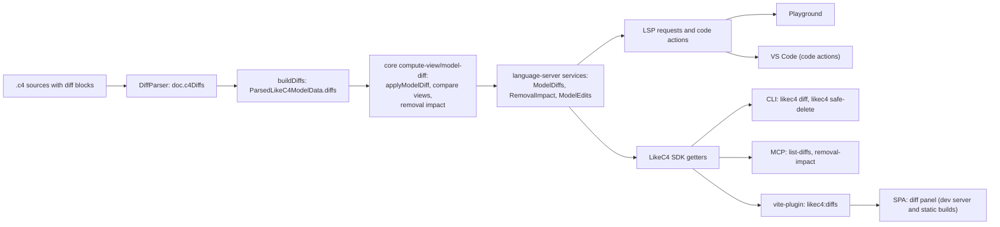

# Model diffs: implementation guide

Audience: LikeC4 core maintainers.
Purpose: explain how model diffs, compare views, safe delete and model edits are implemented, package by package,
so that you can review the changes with the right context. The proposal and its decisions are in the
[RFC](./rfc.md).

- Origin: [discussion #1192](https://github.com/likec4/likec4/discussions/1192),
  approach from [this comment](https://github.com/likec4/likec4/discussions/1192#discussioncomment-11214267).
- Size: about +7.5k / −0.2k lines (source +4.3k, tests +1.4k, playground +1.3k, docs +0.3k), in three PRs
  (section 11).
- User documentation: `apps/docs/src/content/docs/dsl/diff.mdx`. This guide covers the implementation only.

## 1. Summary

- A diff is DSL data. The parser collects it into `ParsedLikeC4ModelData.diffs`.
  `elements` and `relations` stay the model "as is": no diff changes them until the diff is applied.
- The "to-be" model is a pure function in core: `applyModelDiff(data, diff)`.
- A compare view is one view computed against both models, merged into one view with `diffStatus` on nodes and edges,
  and laid out once. The UI filters it per mode (as-is, changes, to-be) without a new layout.
- Model edits (apply a diff, discard a diff, safe delete) are targeted text edits: only the edited ranges change,
  so comments and formatting elsewhere stay as written.
  The language server computes them, previews them, applies them and keeps an in-memory history for roll back.
- Overlapping diffs are detected and reported on both diffs. They are never resolved automatically.
- Consumers use the existing channels: LSP requests (playground, VS Code), the `LikeC4` SDK (CLI, MCP),
  and a new `likec4:diffs` virtual module (SPA, static builds). No new RPC in the Vite plugin.
- Not changed: `packages/layouts` and `packages/core/src/manual-layout` (see section 7).

## 2. Vocabulary

| Term              | Meaning                                                                                                      |
| ----------------- | ------------------------------------------------------------------------------------------------------------ |
| Diff              | Named change set in a `diff` block: `remove` entries and `add` items. Same name in several files = one diff. |
| As-is model       | The model before any diff (`elements`, `relations` of the model data).                                       |
| To-be model       | The model after one diff: `applyModelDiff(data, diff)`.                                                      |
| Diff-only element | An element that exists only in the `add` block of a diff.                                                    |
| Compare view      | A view computed against the as-is and the to-be model, merged, nodes and edges marked with `diffStatus`.     |
| Removal impact    | What removing elements takes with it: descendants, relationships, deployed instances, views, orphans.        |
| Safe delete       | Removal of elements together with everything in the sources that references them.                            |
| Model edit        | Apply diff, discard diff or safe delete, as text edits with preview and roll back.                           |
| Overlap           | Two diffs that change the same element or relationship, or depend on each other.                             |

## 3. Data flow



Edits flow the other way: `ModelEdits` produces text edits, the client (or the file system, without an LSP connection)
writes them, Langium rebuilds the documents, and the model updates as usual.

## 4. Walkthrough by layer

### 4.1 Grammar (`packages/language-server/src/like-c4.langium`)

```langium
ModelDiff:
  'diff' name=Id title=String? '{'
    ( props+=DiffStringProperty | removes+=DiffRemove | adds+=DiffAdd )*
  '}';

DiffRemoveEntry:          // element, or relationship (source, connector, target, title)
  source=FqnRef ( RelationConnector target=FqnRef title=String? )? ';'?;

DiffAdd:
  'add' '{' elements+=ModelElement* '}';   // same items as a model block
```

- `diff` is a top-level block (`diffs+=ModelDiff` in the entry rule).
- `add` reuses `ModelElement`: elements, relationships and `extend` blocks, with the syntax of the `model` block.
- Compatibility: `diff`, `add` and `remove` were valid names before. They stay valid in `Id`, in a new `GlobalId` rule
  (global predicate groups, dynamic predicate groups, style groups and their references), in `CustomColorId`,
  and in `HexColor` (`#add`). Covered by `packages/language-server/src/__tests__/diff.spec.ts`.
- TextMate grammars are updated in `packages/vscode`, `apps/playground` and `apps/docs`.
- The formatter handles `diff`, `remove` and `add` blocks (`formatting/LikeC4Formatter.ts`).

### 4.2 Parsing, scope and linking (`packages/language-server/src/model`, `src/references`)

- `parser/DiffParser.ts` is a new parser mixin. `parseDiffs()` runs after `parseModel()` and fills `doc.c4Diffs`
  (`ParsedAstDiff` in `ast.ts`): `removeElements`, `removeRelations`, `elements`, `relations`, `extendElements`.
- `add` items reuse the model parsers through `streamModelElements` (extracted from `ModelParser.ts`):
  parents first, then relationships.
- A removed element is an FQN. A removed relationship is a `relationFingerprint`
  (source, target, kind, title, direction), the same fingerprint the model uses for relationship ids.
- `fqn-index.ts` and `scope-computation.ts` index `add` blocks like `model` blocks.
  Result: diff-only elements resolve everywhere (views, relationships, other diffs). No linking errors.
- The as-is model does not contain diff-only elements: `c4Elements` and `c4Relations` come from `model` blocks only.

### 4.3 Model building (`model/builder/buildDiffs.ts`, `buildModel.ts`, `model-builder.ts`)

- `buildDiffs` runs in `buildModelData` after elements and relationships are built:
  - groups parsed diffs by id over all documents of the project (one diff can span files);
  - adds elements parents first and skips an element whose parent does not exist;
  - `extend` of an as-is element goes to `modify.elements` (tags, links, metadata);
  - `extend` of an element that the same diff adds is merged into that element (`mergeElementOverlay`);
  - skips invalid entries (validation reports them): missing removal targets, relationships with missing endpoints.
- Output: `ParsedLikeC4ModelData.diffs?: Record<DiffId, ModelDiff>`. The field is absent when there are no diffs,
  so model data of projects without diffs does not change.
- `computeModel` calls `withoutDiffOnlyReferences(view, data)` before `computeView`:
  view references to diff-only elements are dropped, and a view scoped to a diff-only element (`view of`)
  does not exist in the as-is model. Views of projects without diffs are returned unchanged.

### 4.4 Validation (`validation/diff.ts`, `validation/element.ts`)

| Check                                                               | Severity |
| ------------------------------------------------------------------- | -------- |
| Diff has no `remove` and no `add`                                   | warning  |
| `extend` of a relationship inside `add`                             | error    |
| Removed item is not a model element                                 | error    |
| Removed element is added by a diff                                  | error    |
| Removed relationship matches no as-is relationship (by fingerprint) | error    |
| Added element already exists in the model (duplicate name check)    | error    |
| Diff overlaps another diff (on both diff names)                     | warning  |

- The same element added by two different diffs is not a duplicate: it is an overlap.
- Overlaps and as-is relationship fingerprints are cached per project in a `WorkspaceCache`
  that resets at `DocumentState.Linked`.

### 4.5 Core (`packages/core`)

Types (`src/types/model-diff.ts`, `view-computed.ts`):

- `DiffId` (tagged string), `ModelDiff` (`remove`, `add`, `modify`), `ModelDiffElementOverlay`,
  `DiffStatus = 'added' | 'removed' | 'modified' | 'orphan'`, `DiffSummary`, `DiffViewSummary`, `DiffStatusCounts`.
- `ComputedNode` and `ComputedEdge` get two optional fields: `diffStatus`, and `diffBefore` (properties of a
  modified node or edge before the diff). Only compare views and removal impact views set them.

`src/compute-view/model-diff/`:

- `applyModelDiff(data, diff)` returns the to-be model data. Removed elements take their descendants,
  relationships and deployed instances. Added elements need an existing parent; added relationships need existing
  endpoints. Global predicates and styles are cleaned of missing elements. Views are returned unchanged.
- `sanitize.ts`: `sanitizeParsedView` drops view rule references to elements missing in a model state
  (returns `null` for a view scoped to a missing element); `sanitizeGlobals` does the same for global groups.
- Compare views (`compare-view.ts`):
  1. `createCompareModels(data, diffId)`: `before` = as-is `LikeC4Model`, `after` = `LikeC4Model` of `applyModelDiff`.
  2. `computeCompareView(view, models)`: sanitize and compute the parsed view in each state.
  3. Merge: nodes match by id; edges match by id, then by `astPath` (dynamic view steps), then by source and target.
     - node: `added`, `removed`, or `modified` (listed in `modify.elements`, or title, kind, technology,
       description or tags changed); `diffBefore` keeps the old title, description, technology, tags, color, shape, icon;
     - edge: `added`, `removed`, or `modified` (its set of relationships changed);
     - a removed edge whose id is reused in the to-be view gets the id suffix `~removed`;
     - `hash` = hash of `compare:<before hash>:<after hash>`; `isAffected` = at least one change.
  4. `filterCompareView(view, mode)` runs on the laid-out view: `as-is` hides `added` items and restores
     `diffBefore`; `to-be` hides `removed` items; `changes` returns the view unchanged. Children of hidden nodes
     are hidden. Positions do not change, so switching modes does not move nodes.
- Removal impact (`removal-impact.ts`): `computeRemovalImpact` returns targets, removed elements, relationships,
  deployed instances, empty deployment nodes, affected views, views scoped to removed elements, and orphans
  (elements left without relationships, never removed automatically). `removalImpactViewPredicates` builds an
  ad-hoc view of the impact; `markRemovalImpact` sets `removed`, `modified` and `orphan` statuses on it.
- `src/utils/diff-lines.ts`: line diff for edit previews (playground review dialog, CLI dry run).

### 4.6 Language server services (`packages/language-server/src/model-diff`)

Registered in `module.ts` as `likec4.ModelDiffs`, `likec4.RemovalImpact`, `likec4.ModelEdits`,
and `lsp.ExecuteCommandHandler`.

`LikeC4ModelDiffs` (`ModelDiffs.ts`):

- `list(projectId)`: `DiffSummary[]` with the views each diff changes (only views with `isAffected`).
- `layoutCompareView({ viewId, diffId, projectId })`: Graphviz layout of one compare view (`DiagramView | null`).
- `checkBeforeApply(diffId)`: errors inside the diff and overlaps with other diffs.
- `addEdits(edits, diffId, 'apply' | 'discard')`: the text edits of an apply or a discard (see below).
- Compare models and views are cached per diff in a `WeakMap` keyed by the parsed model data, so a model change
  recomputes them.

`LikeC4RemovalImpact` (`RemovalImpact.ts`, `references.ts`):

- `analyze(targets)`: report with the core removal impact and every source reference to the removed elements.
- Each reference has a resolution: `removed` (removed with the element), `optional` (views scoped to the element,
  dynamic view steps: removed only on request), `manual` (must be fixed by a person).
  References inside diffs are always `manual`: an edit never changes another diff.
- `impactView(targets)`: laid-out ad-hoc view of the impact.
- `addEdits(edits, targets, options)`: the safe delete edits (options: orphans, scoped views, dynamic steps).
  Comma-separated lists (`include a, b`, `style a, b`, imports) lose only the removed item.

Apply algorithm (`ModelDiffs.addEdits`, `merge-apply.ts`):

Apply changes the source text in place and does not regenerate files with the DSL generator. The generator drops
comments and formatting ("DSL writeback is lossy" in AGENTS.md), so regeneration would rewrite lines the diff does not
touch. A merged item keeps its own text from the diff, re-indented to the target block.

1. Remove the `remove.elements` through the safe delete edits, with scoped views and dynamic steps.
2. Delete the AST nodes of `remove.relations` and the relationship `extend` blocks with the same fingerprint.
3. Merge each `add` block into the model:
   - `extend` of an as-is element goes into the element definition: tags and links are added if missing,
     metadata keys override existing keys, children and relationships go to the end of the element body;
   - a relationship goes to the `model` block that defines the root element of its source;
   - a new root element goes to the `model` block with the most root elements.
4. Delete the diff block with the comment lines right above it. If some items had no target block,
   the diff block is replaced with a `model { ... }` block that holds them.

Discard runs step 4 only, without the merge.

What the apply keeps: only the model changes. Step 3 copies the source text of each merged item (its CST range).
Everything else in the diff block is the diff's own text, and step 4 deletes it.

| In the diff                                                                       | After apply                      |
| --------------------------------------------------------------------------------- | -------------------------------- |
| Removals, added elements and relationships, `extend` tags, links and metadata     | written into the model           |
| Comments inside the braces of an added element                                    | kept, they move with the element |
| Title and description of the diff                                                 | deleted                          |
| Comments in `remove`, above or after an item, inside an `extend` around the items | deleted                          |
| Comment lines right above the diff                                                | deleted                          |

Example (output of an in-memory apply, the same example is in `dsl/diff.mdx`):

```likec4
// RFC-1 was approved in the architecture review         <- deleted
diff rfc1 'RFC-1: Payments service' {
  description 'Replace the SOAP gateway with a Payments service'   // <- deleted

  remove {
    // The Payments service replaces the gateway         <- deleted
    shop.legacyPayments
  }

  add {
    extend shop {
      // Owned by the payments team                      <- deleted
      payments = container 'Payments Service' {
        // Calls the REST API of the bank                <- kept, moves with the element
        technology 'Go'
      }
    }
    shop.orders -> shop.payments 'charges'
    shop.payments -> bank 'calls REST API'
  }
}
```

After apply, the model block is:

```likec4
model {
  shop = system 'Online Shop' {
    orders = container 'Order Service'
    payments = container 'Payments Service' {
      // Calls the REST API of the bank
      technology 'Go'
    }
  }
  bank = system 'Bank'

  shop.orders -> shop.payments 'charges'
  shop.payments -> bank 'calls REST API'
}
```

To keep the reasoning of a diff, write it into the model (for example, the `description` of an element)
or into the commit message of the apply.

`LikeC4ModelEdits` (`ModelEdits.ts`):

- Requests: `{ type: 'apply-diff', diffId, action, acceptOverlaps? }` and `{ type: 'safe-delete', targets, options? }`.
- `preview(request)`: before and after text of each changed document, overlaps, and a `token`
  (hash of the after texts).
- `apply(request, { token })`: refuses a diff with errors; refuses an overlapping diff without `acceptOverlaps`;
  refuses if the edits differ from the previewed token (the model changed after the preview).
- History: the last 20 applied edits, in memory (lost when the server restarts).
- `rollback(editId?)`: restores the before texts if no changed document was modified after the edit.

Write path (`apply-edits.ts`, `applyDocumentEdits`):

- With an LSP connection: `workspace/applyEdit`. If the client supports change annotations, the edit carries
  `needsConfirmation` (VS Code shows its refactor preview). The function waits for the rebuild (5 s timeout).
- Without a connection (CLI, MCP, SDK): writes the files through `FileSystemProvider` and updates the builder.
  If a write fails, the files written before it are restored and the result is `applied: false` with the reason
  (a file that cannot be restored is named). A workspace from `fromSource` has no file system: preview works,
  apply returns `applied: false`.
- Result: errors left in the changed documents, plus errors that are new in other documents.
  Each error carries the `diffId` it is in, so "the edit broke diff X" is explicit.

Overlaps (`overlaps.ts`): a footprint per diff (removes, adds, relationships, elements it extends, relates to or
adds children to, metadata keys). Two diffs overlap when:

- both remove the same element (or an ancestor of it) or the same relationship;
- both add the same element or relationship;
- both set the same metadata key of an element to different values;
- one removes an element that the other uses;
- one uses an element that only the other adds.

### 4.7 LSP protocol and commands (`protocol.ts`, `Rpc.ts`, `lsp/`)

| Request or notification                            | Purpose                                           |
| -------------------------------------------------- | ------------------------------------------------- |
| `likec4/fetch-diffs`                               | Diff summaries of a project                       |
| `likec4/layout-compare-view`                       | Laid-out compare view of one view and one diff    |
| `likec4/fetch-removal-impact`                      | Removal impact report and impact diagram          |
| `likec4/preview-model-edit`                        | Preview of an apply, discard or safe delete       |
| `likec4/apply-model-edit`                          | Apply a model edit (with the preview token)       |
| `likec4/rollback-model-edit`                       | Roll back an applied edit                         |
| `likec4/onRequestRemovalImpact` (server to client) | Ask the client to show the removal impact preview |

Code actions (`CodeActionProvider.ts`) run commands of `ExecuteCommandHandler.ts`:

- on an element (outside diffs): "Safe delete" (`likec4.lsp.safe-delete`), and "Preview removal impact"
  (`likec4.lsp.preview-removal-impact`) only if the client sets `initializationOptions.removalImpactPreview`
  (the playground does, VS Code does not);
- on a diff name: "Apply diff" (`likec4.lsp.apply-diff`) and "Discard diff" (`likec4.lsp.discard-diff`).

### 4.8 SDK (`packages/language-services/src/common/LikeC4.ts`)

Three getters on the `LikeC4` class, documented in `tooling/model-api.mdx`:
`likec4.modelDiffs`, `likec4.removalImpact`, `likec4.modelEdits`.
`LikeC4LanguageServices` (language-server) exposes `modelDiffs` and `removalImpact`.

### 4.9 Diagram and styles

- `packages/diagram/src/likec4diagram/xyflow-diagram/diagram-view.ts` maps `diffStatus` to the CSS classes
  `likec4-diff likec4-diff-<status>` on nodes and edges. This is the only diagram change: a compare view is an
  ordinary `LayoutedView`, and the diagram has no diff state.
- `styled-system/preset/src/globalCss.ts` styles the classes (outline, dashed and faded removed items).
  Colors are semantic tokens `likec4.diff.{added,modified,removed,orphan}` in
  `tokens-semantic/semantic-colors.likec4.ts`. Both legends (SPA, playground) use the same tokens.

### 4.10 Vite plugin and SPA

- `packages/vite-plugin/src/virtuals/diffs.ts`: `likec4:diffs` (`loadDiffs(projectId)`) and
  `likec4:diffs/<projectId>` (`$diffs` atom) with `{ diffs: DiffSummary[]; views: { [diffId]: { [viewId]: LayoutedView } } }`.
  Only affected views have a compare view. Registered in `plugin.ts` (HMR lists) and declared in `modules.d.ts`.
  Static builds inline the data as JSON; the dev server regenerates it on each model change while it is loaded.
- `packages/likec4-spa`:
  - route loaders (`routes/project.$projectId/route.tsx`, `routes/_single/route.tsx`) load the diffs with the model;
  - `context/ModelDiffsContext.tsx` provides the atom;
  - `components/model-diff/ModelDiffPanel.tsx`: diff selector, mode switch, legend, and `useCompareView(viewId)`;
  - `components/model-diff/state.ts`: selected diff and mode in a nanostore (kept across views);
  - `pages/ViewEditor.tsx` (dev) and `pages/ViewReact.tsx` (static) show the compare view instead of the view.
    While comparing, editing, element details, relationship details and browser, walkthrough and
    compare-with-latest are off: compare views contain elements that are not in the model.
- The SPA is read-only for diffs: no apply, no safe delete.

### 4.11 Playground (`apps/playground`)

- `monaco/LanguageClientSync.tsx` sends the LSP requests of section 4.7 to the in-browser language server.
- `state/playground-machine.ts` gets events for diffs, compare views, removal impact, edit preview, approve
  (with `acceptOverlaps`), apply result and roll back.
- Components (`components/model-diff/`): diff panel and controls, legend, removal impact panel,
  review dialog (`ModelEditReview.tsx`: per-file line diff, overlap confirmation), last edit banner with roll back.
- `monaco/config.ts` sets `initializationOptions.removalImpactPreview`.
- Example workspace `examples/diff/`: a model, RFC-1 and an overlapping RFC-2.

### 4.12 CLI and MCP

| Command                               | Options                                                                 |
| ------------------------------------- | ----------------------------------------------------------------------- |
| `likec4 diff list [path]`             | `--project`, `--json`                                                   |
| `likec4 diff apply <diff> [path]`     | `--project`, `--dry-run`, `--accept-overlaps`                           |
| `likec4 diff discard <diff> [path]`   | `--project`, `--dry-run`                                                |
| `likec4 safe-delete <element> [path]` | `--dry-run`, `--orphans`, `--scoped-views`, `--dynamic-steps`, `--json` |

- Without `--project`, `diff list` covers all projects, and `diff apply`, `diff discard` and `safe-delete` use the only
  project that has the diff or element (`findProject` in `cli/model-edits.ts`). With `--json`, logs go to stderr,
  so stdout has only JSON.

- `packages/likec4/src/cli/model-edits.ts` prints previews (line diff) and edit results for both commands.
- MCP tools `list-diffs` and `removal-impact` are read-only (`readOnlyHint: true`).
  The MCP server cannot change the model.

### 4.13 VS Code

No extension code changes besides the TextMate grammar. VS Code gets the code actions through the LSP,
and edits go through its refactor preview. Compare views are not in the VS Code preview panel.

## 5. New public surface

| Area           | Addition                                                                                                                                                                                                                                                                                                 |
| -------------- | -------------------------------------------------------------------------------------------------------------------------------------------------------------------------------------------------------------------------------------------------------------------------------------------------------- |
| DSL            | `diff` block with `remove` and `add`; keywords `diff`, `add`, `remove` (still valid as names)                                                                                                                                                                                                            |
| Model data     | `ParsedLikeC4ModelData.diffs?` (also in computed and layouted data)                                                                                                                                                                                                                                      |
| Core types     | `DiffId`, `ModelDiff`, `ModelDiffElementOverlay`, `DiffStatus`, `DiffSummary`, `DiffViewSummary`, `DiffStatusCounts`; `diffStatus?`, `diffBefore?` on computed nodes and edges                                                                                                                           |
| Core functions | `@likec4/core/compute-view`: `applyModelDiff`, `mergeElementOverlay`, `createCompareModels`, `computeCompareViews`, `filterCompareView`, `withoutDiffOnlyReferences`, `computeRemovalImpact`, `markRemovalImpact`, `removalImpactViewPredicates`; `@likec4/core/utils`: `diffLines`, `collapseUnchanged` |
| LSP            | 6 requests, 1 notification, 4 commands (section 4.7)                                                                                                                                                                                                                                                     |
| SDK            | `LikeC4.modelDiffs`, `LikeC4.removalImpact`, `LikeC4.modelEdits`                                                                                                                                                                                                                                         |
| CLI            | `likec4 diff list`, `likec4 diff apply`, `likec4 diff discard`, `likec4 safe-delete`                                                                                                                                                                                                                     |
| MCP            | `list-diffs`, `removal-impact`                                                                                                                                                                                                                                                                           |
| Vite plugin    | `likec4:diffs`, `likec4:diffs/<projectId>`                                                                                                                                                                                                                                                               |
| Style preset   | tokens `likec4.diff.added`, `.modified`, `.removed`, `.orphan`                                                                                                                                                                                                                                           |
| Docs           | new page `dsl/diff.mdx`; updates in `dsl/intro.mdx`, `tooling/cli.mdx`, `tooling/ai-tools.mdx`, `tooling/model-api.mdx`, `tooling/vite-plugin.mdx`; `likec4-dsl` skill references                                                                                                                        |

## 6. Effect on existing behavior

- Projects without diffs: the model data has no `diffs` field, `withoutDiffOnlyReferences` returns views unchanged,
  and the SPA loads an empty `likec4:diffs` module (about 0.1 kB).
- Keywords: existing sources that use `diff`, `add` or `remove` as names keep parsing (section 4.1).
- Edits never change other diffs. A reference inside a diff is reported as a manual fix.
- Static builds include the diffs of their sources, so a published site shows planned changes.
  The docs explain how to exclude diff files in the project configuration.

## 7. What is not changed, and why

- `packages/layouts`: compare views and impact views are ordinary computed views. The existing Graphviz layouter
  lays them out.
- `packages/core/src/manual-layout` (view drift): compare views are derived, never saved, and editing is off while
  a compare view is shown. A compare view always uses the automatic layout, even if the view has a manual layout.
- Model data of the as-is model: `elements` and `relations` keep their meaning. Every consumer that ignores `diffs`
  sees the same model as before.

## 8. Performance

- Language server: compare models per diff are computed on demand and cached per parsed model instance.
  A compare view is laid out on request.
- Validation: overlaps are computed once per project per link cycle (pairs of diffs, in memory).
- Vite plugin: the diffs module lays out every affected compare view of every diff. Static builds do it once.
  The dev server repeats it on each model change while the module is loaded.
- Edits: previews build the new texts in memory; apply writes only the changed files.

## 9. Tests

| Spec                                                                             | Covers                                                                                                                                                         |
| -------------------------------------------------------------------------------- | -------------------------------------------------------------------------------------------------------------------------------------------------------------- |
| `packages/core/src/compute-view/model-diff/model-diff.spec.ts`                   | apply, view sanitizing, compare view merge and statuses, mode filter, removal impact                                                                           |
| `packages/core/src/utils/diff-lines.spec.ts`                                     | line diff                                                                                                                                                      |
| `packages/language-server/src/__tests__/diff.spec.ts`                            | keywords stay valid as names (grammar positions of section 4.1)                                                                                                |
| `packages/language-server/src/model/__tests__/model-builder-diff.spec.ts`        | build diffs without changing the model, multi-file diffs, views with diff-added elements, validation errors, formatting                                        |
| `packages/language-server/src/model-diff/model-diff-services.spec.ts`            | safe delete, references in diffs, overlaps, apply (merge, same result as `applyModelDiff`, comments), discard, preview, stale token, roll back, write failures |
| `packages/language-services/src/__tests__/LikeC4.modelEdits.spec.ts`             | SDK apply on a workspace without a file system                                                                                                                 |
| `packages/language-server/src/lsp/CompletionProvider.spec.ts`                    | keyword completion (updated)                                                                                                                                   |
| `packages/mcp/src/tools/model-diff-tools.spec.ts`, `createMCPServer.int.spec.ts` | MCP tools                                                                                                                                                      |
| `packages/vite-plugin/src/virtuals/diffs.spec.ts`                                | virtual module content                                                                                                                                         |
| `e2e/tests/static-build-model-diffs.spec.ts` (`e2e/src/model-diffs`)             | diff selector and compare modes in a static build                                                                                                              |
| `packages/likec4/src/cli/model-edits.spec.ts`                                    | CLI: the project of a diff or element (`findProject`)                                                                                                          |
| `e2e/src/likec4-cli-diff.spec.ts`                                                | CLI in a workspace with several projects: `diff list --json`, `diff apply --dry-run`, `safe-delete` of an unknown element                                      |

## 10. Known limitations

- Compare views are not in the VS Code preview panel.
- No views inside a diff, and no rename or move of an element.
- Roll back works only while the same language server runs (last 20 edits). After a restart or a page reload,
  use git or the editor's undo.
- Compare views ignore manual layouts.
- The notes of a diff do not survive the apply: its title, description and comments around the items are deleted
  with the diff block (section 4.6, "What the apply keeps"). Only comments inside the braces of an added element
  move with it.
- Merged items go where fixed rules put them (section 4.6). A new root element goes to the `model` block with
  the most root elements, which is not always the place a person would pick.

## 11. Suggested review order

This order follows the dependencies. The commits of the branch are grouped in the same three PRs,
and each PR builds and passes `pnpm typecheck` and `pnpm test` on its own:

1. DSL and model: grammar, TextMate grammars, formatter; core types, `applyModelDiff`, `sanitize.ts`, compare views,
   removal impact; `DiffParser`, scope and FQN index, `buildDiffs`, `computeModel` change, validation (without
   overlaps); docs for the syntax and validation.
2. Edits and tooling: `diffLines`; `ModelDiffs`, `RemovalImpact`, `ModelEdits`, `merge-apply.ts`, `apply-edits.ts`,
   `overlaps.ts`, overlap validation, LSP protocol and commands; SDK getters, CLI, MCP; docs for overlaps, apply,
   discard and safe delete.
3. UI: diagram classes and style tokens, `likec4:diffs`, SPA, playground, e2e test; docs for compare views.
